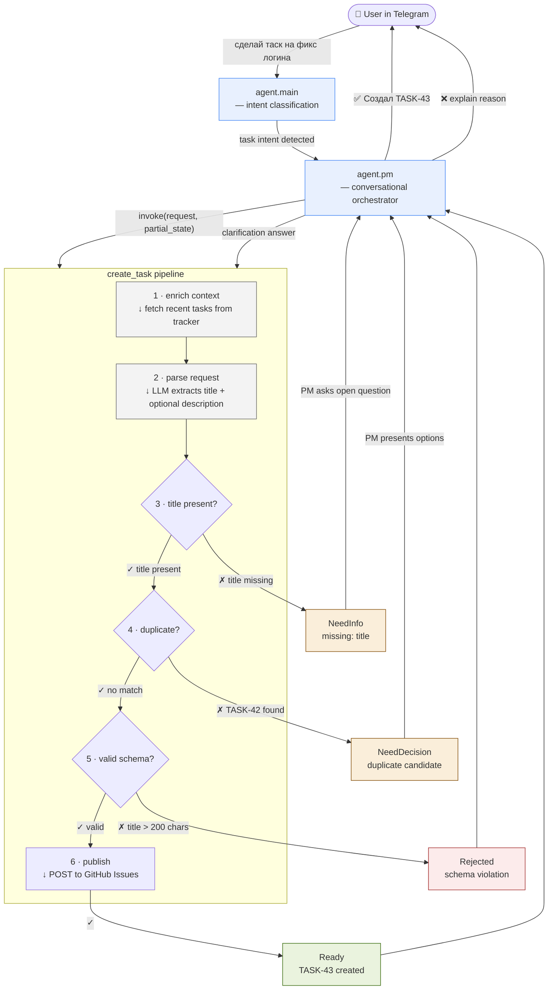

# YAAF — Yet Another AI Factory

> Autonomous software development pipeline powered by the **OpenClaw** ecosystem.
> Human gives the idea. Agents deliver the Pull Request.

---

## Vision

YAAF is a **24/7 conveyor-belt factory** for software features. A human submits a high-level request — for example, *"Add WS2016 support to Packer templates"* — and a team of specialized AI agents carries it through specification, architecture, implementation, quality assurance, and documentation, producing a ready-to-merge Pull Request with passing tests and updated docs.

**Core principles:**

- **Zero-intervention execution** — once a feature request is accepted, no human action is required until the final review.
- **Stateless pipelines** — each pipeline invocation is self-contained; clarification context is passed via `partial_state`.
- **Adversarial quality gates** — a dedicated QA agent validates every output before the pipeline advances.

---

## Stack

| Component | Role |
|-----------|------|
| **OpenClaw** | AI agent runtime — manages agent sessions, tool invocations, and inter-agent communication. |
| **Lobster** | Workflow execution runtime — runs skill definitions, tool invocations, and iterative loops (code → validate → fix). |

---

## Task Management

YAAF includes a conversational task creation flow. Users send natural language messages (e.g. "сделай таск на фикс логина") and the system structures the request and publishes it to GitHub Issues.



**Three layers, strict boundaries:**

| Layer | Component | Does | Does NOT |
|-------|-----------|------|----------|
| **Routing** | `agent.main` | Detect task intent, delegate to PM | Know task fields or pipeline |
| **Orchestration** | `agent.pm` | Run clarification loop, assemble `partial_state` | Parse NL into structured fields |
| **Execution** | `create_task` | Extract fields, require title, exact-match dedup, publish new task | Talk to user or manage clarification loop |

**Clarification loop** — if the pipeline returns `NeedInfo` or `NeedDecision`, PM asks the user and re-invokes with accumulated context (`partial_state`). The max 3 re-invocations limit is enforced by `agent.pm`, not by `create_task` itself.

**Current duplicate handling** — `create_task` returns `NeedDecision` when it finds a case-insensitive exact title match among non-`Done` tasks. If the user chooses to create a new task, PM re-invokes with `dedup_decision: "create_new"`. Choosing an existing task is outside `create_task` and belongs to a future `update_task` flow.

See [docs/workflows/create-github-issue.md](docs/workflows/create-github-issue.md) for the main workflow, [docs/workflows/approve-task.md](docs/workflows/approve-task.md) for the approval pipeline, [docs/reference/contracts.md](docs/reference/contracts.md) for runtime contracts, and [docs/index.md](docs/index.md) for the full documentation map.

---

## Quick Start

### Prerequisites

- Node.js runtime.
- `GITHUB_TOKEN` environment variable set (GitHub PAT with repo scope).
- This repository cloned locally.

### Run tests

```bash
npm test
```

### Use the pipeline programmatically

```js
const { createTask, approveTask } = require('./lobster/lib/tasks');
const { createGitHubTracker } = require('./lobster/lib/github');

const tracker = createGitHubTracker({ owner: 'org', repo: 'project' });

// Create a task (starts in Draft with status:draft label)
const result = await createTask({ request: 'Fix login bug', partial_state: null }, { tracker, llm });

// Approve: Draft → Backlog
const approval = await approveTask({ issue_id: result.task.id }, { tracker });
// approval.task.newState === 'Backlog'

// Approve again: Backlog → Ready
const ready = await approveTask({ issue_id: result.task.id }, { tracker });
// ready.task.newState === 'Ready'
```

---

## Repository Structure

```
yaaf/
├── lobster/          # Lobster — workflows and runtime modules
│   ├── lib/
│   │   ├── tasks/    # create_task + approve_task + review_task + publish_task pipelines
│   │   ├── github/   # GitHub REST/GraphQL client + tracker adapters
│   │   ├── openclaw/ # OpenClaw agent runner
│   │   └── usage/    # Hourly/daily usage aggregator
│   └── workflows/    # Pipeline definitions (.lobster)
├── docs/             # All project documentation
│   ├── index.md      # Navigation hub
│   ├── overview/     # Product overview and repository map
│   ├── architecture/ # System boundary and runtime component docs
│   ├── workflows/    # Main execution flows
│   ├── integrations/ # GitHub, Symphony, usage
│   ├── reference/    # Contracts, config, testing
│   └── decisions/    # Architecture Decision Records (ADR)
├── test/             # Test suites
└── README.md
```

---

## License

See [LICENSE](LICENSE).
