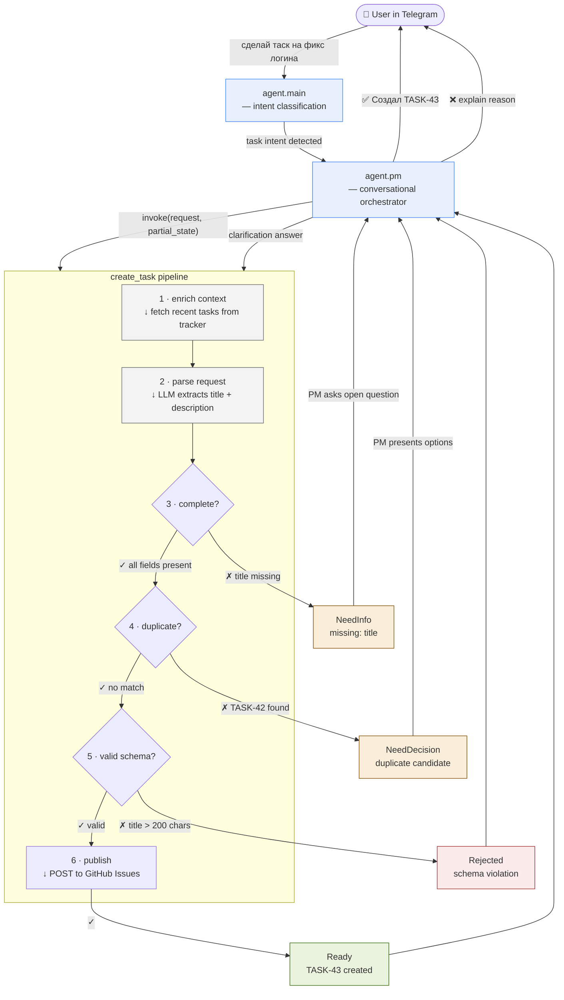

# YAAF — Yet Another AI Factory

> Autonomous software development pipeline powered by the **OpenClaw** ecosystem.
> Human gives the idea. Agents deliver the Pull Request.

---

## Vision

YAAF is a **24/7 conveyor-belt factory** for software features. A human submits a high-level request — for example, *"Add WS2016 support to Packer templates"* — and a team of specialized AI agents carries it through specification, architecture, implementation, quality assurance, and documentation, producing a ready-to-merge Pull Request with passing tests and updated docs.

**Core principles:**

- **Zero-intervention execution** — once a feature request is accepted, no human action is required until the final review.
- **Checkpoint-driven state** — every agent persists its progress so sessions can resume after interruptions.
- **Adversarial quality gates** — a dedicated QA agent validates every output before the pipeline advances.

---

## Stack

| Component | Role |
|-----------|------|
| **Symphony** | State orchestrator — manages long-lived agent sessions, routes tasks between roles, tracks checkpoints and phase transitions. |
| **Lobster** | Workflow execution runtime — runs skill definitions, tool invocations, and iterative loops (code → validate → fix). |
| **ACPX** | Debug protocol — provides session introspection, step replay, and inter-agent communication tracing. |

**How they connect:**

1. Symphony receives a feature request and spawns a *Symphony session*.
2. It assigns the session to the **Product Owner** agent, who creates `docs/FEATURE_SPEC.md`.
3. Symphony advances the pipeline phase and hands the session to the next agent.
4. Each agent executes its work inside **Lobster** workflows (`workflows/*.lobster`).
5. **ACPX** is available throughout for debugging stalled or looping sessions.

---

## Task Management

YAAF includes a conversational task creation flow. Users send natural language messages (e.g. "сделай таск на фикс логина") and the system structures the request and publishes it to GitHub Issues.



**Three layers, strict boundaries:**

| Layer | Component | Does | Does NOT |
|-------|-----------|------|----------|
| **Routing** | `agent.main` | Detect task intent, delegate to PM | Know task fields or pipeline |
| **Orchestration** | `agent.pm` | Run clarification loop, assemble `partial_state` | Parse NL into structured fields |
| **Execution** | `create_task` | Extract fields, validate, dedup, publish | Talk to user |

**Clarification loop** — if the pipeline returns `NeedInfo` or `NeedDecision`, PM asks the user and re-invokes with accumulated context (`partial_state`). Max 3 re-invocations, then PM asks to reformulate.

See [docs/create-task-flow.md](docs/create-task-flow.md) for the full feature spec and [docs/contracts/create-task-contract.md](docs/contracts/create-task-contract.md) for the pipeline API reference.

---

## Quick Start

### Prerequisites

- Symphony CLI (`claw`) installed and configured.
- Lobster runtime available in PATH.
- This repository cloned locally.

### Launch your first feature

```bash
# Initialize a new Symphony session with your feature request
claw session create --request "Add WS2016 support to Packer templates"

# The pipeline starts automatically:
#   PO → Architect → Coder → QA → Tech Writer
# Monitor progress in PIPELINE_STATUS.md or via:
claw session status
```

The session creates `docs/FEATURE_SPEC.md`, plans tasks in `docs/TASKS.json`, implements code, runs tests, and finalizes documentation — all autonomously.

### Manual phase advancement (optional)

```bash
# If an agent is waiting for human input:
claw session advance --session-id <ID>

# Resume a checkpointed session:
claw session resume --session-id <ID>
```

---

## Monitoring

The file [`PIPELINE_STATUS.md`](PIPELINE_STATUS.md) is the single source of truth for pipeline progress. Agents update it in real time as they complete phases.

| Field | Description |
|-------|-------------|
| **Current Phase** | Active pipeline stage (e.g., `init-spec`, `loop-coding`) |
| **Active Agent** | The role currently executing (e.g., `QA & Validator`) |
| **Progress** | Completed vs total tasks (`3/7`) |
| **Last Logs** | Truncated output from the most recent agent action |

You can also query status programmatically:

```bash
claw session status --format json
```

---

## Repository Structure

```
yaaf/
├── agents/           # Agent role definitions and protocols
│   ├── ROLES.md
│   └── pm.md         # PM agent — task creation orchestrator
├── skills/           # Reusable skill definitions for Lobster
│   └── tasks.md      # Intent routing rules for task management
├── workflows/        # Lobster workflow templates
│   ├── feature-lifecycle.lobster
│   └── create-task.lobster
├── lib/              # Runtime modules
│   ├── tasks/        # create_task pipeline implementation
│   └── telemetry/    # Session telemetry service
├── symphony/         # Symphony session configurations
├── scripts/          # Automation and utility scripts
├── instructions/     # Agent constitution and system prompts
│   └── SYSTEM_PROMPT.md
├── docs/             # Specs, contracts, decisions
│   ├── create-task-flow.md
│   ├── contracts/
│   └── decisions/
├── test/             # Test suites
├── PIPELINE_STATUS.md
├── CHECKPOINT.md          # Auto-generated by agents at session end
└── README.md
```

---

## License

See [LICENSE](LICENSE).
