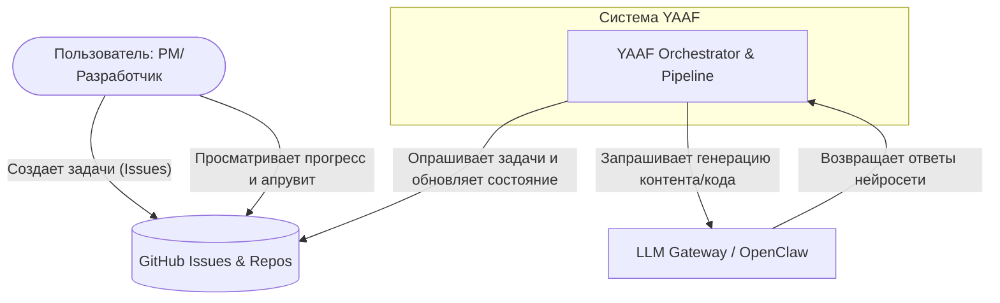

# Архитектура YAAF: Уровень C0 (Контекст)

Эта диаграмма описывает место системы YAAF в общей экосистеме и её взаимодействие с внешними участниками и системами.

### Описание
*   **User**: Инициирует процесс, создавая Issue в GitHub.
*   **YAAF**: Автономная фабрика ПО, которая мониторит GitHub и выполняет рабочие процессы.
*   **GitHub**: Служит единственным источником истины (Source of Truth) и хранилищем состояния задач.
*   **LLM Gateway**: Внешний интерфейс для доступа к моделям ИИ (GPT, Claude и т.д.).
