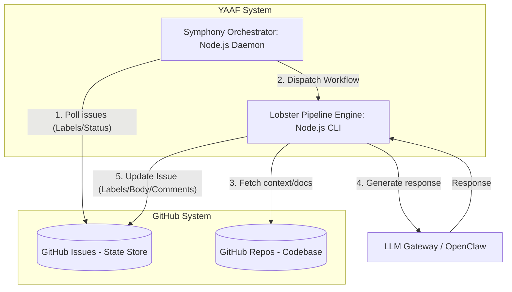

# Архитектура YAAF: Уровень C1 (Контейнеры)

Эта диаграмма детализирует основные контейнеры внутри системы YAAF и их взаимодействие.

### Контейнеры
*   **Symphony**: Постоянно работающий демон, который следит за изменениями меток (labels) в GitHub и запускает нужные процессы.
*   **Lobster**: CLI-инструмент для выполнения детерминированных шагов (LLM-запросы, чтение доков, обновление GitHub).
*   **GitHub (State Store)**: Используется как база данных состояния через механизм меток (Labels).
*   **OpenClaw**: Унифицированный шлюз для доступа к агентам и LLM.
