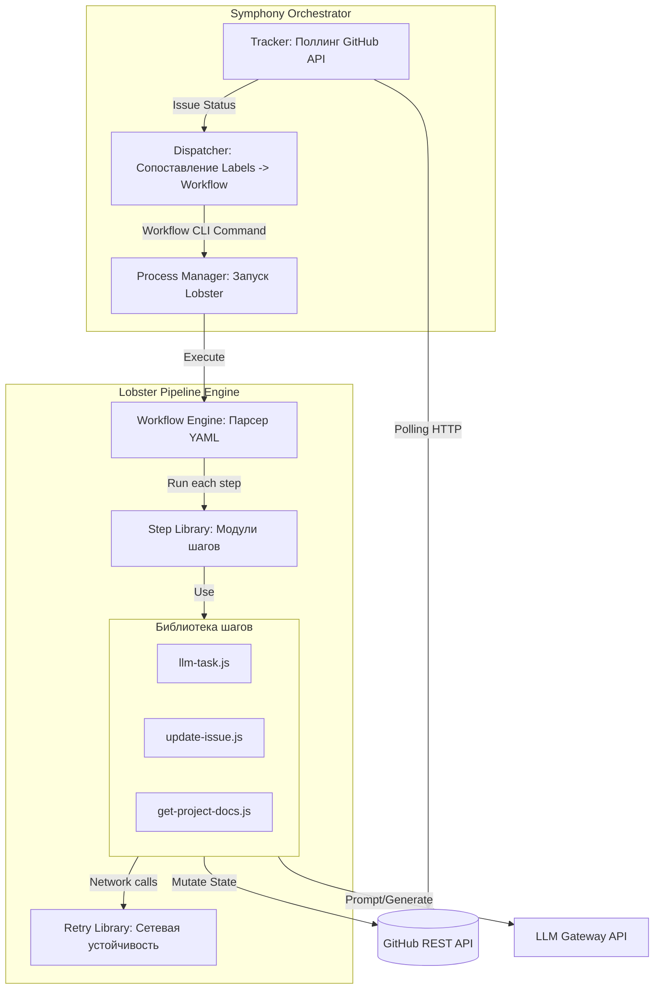

# Архитектура YAAF: Уровень C2 (Компоненты)

Эта диаграмма описывает внутренние компоненты контейнеров Symphony и Lobster.

### Компоненты Symphony
*   **Tracker**: Модуль, отвечающий за связь с GitHub API и определение текущего состояния задач.
*   **Dispatcher**: Логическое ядро, решающее, какой `.lobster` файл запустить для текущего состояния задачи.
*   **Process Manager**: Компонент для системного запуска Lobster как дочернего процесса.

### Компоненты Lobster
*   **Workflow Engine**: Парсит `.lobster` (YAML-подобные) файлы и управляет потоком данных между шагами через stdin/stdout.
*   **Step Library**: Набор атомарных функций (чтение доков, отправка промпта, обновление GitHub).
*   **Retry Library**: Общий компонент для обеспечения надежности сетевых запросов с экспоненциальной задержкой.
