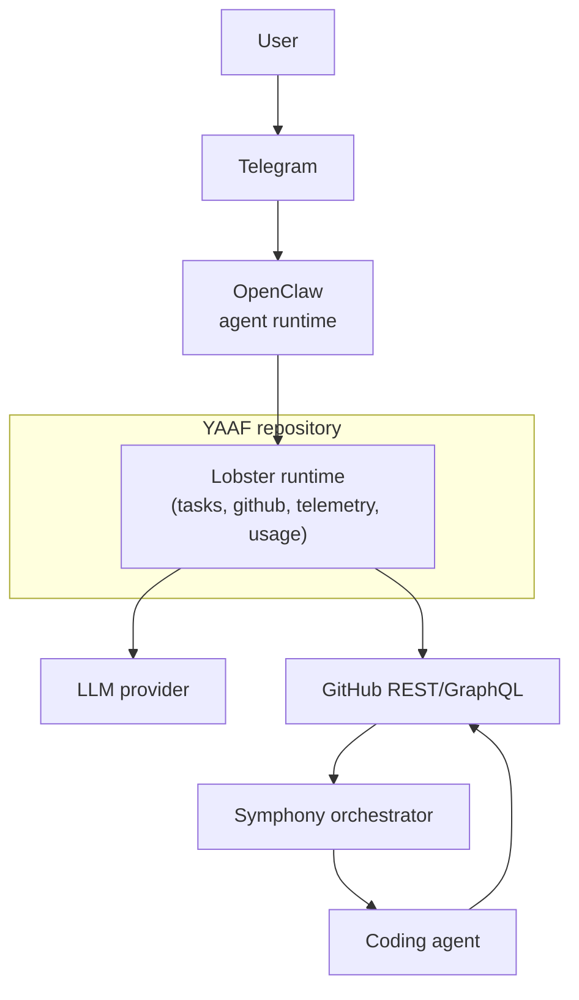

# System Overview

YAAF sits between user intent, issue tracking, and orchestration.

The repository itself is not the whole platform. It implements the task-processing and integration layer that other systems call into.

## High-Level System Boundary

## Architectural Layers

| Layer | Primary responsibility | Key files |
|---|---|---|
| Interaction layer | Accept user messages and route them into task workflows | OpenClaw runtime, `lobster/skills/tasks.md` |
| Workflow layer | Run deterministic pipelines with typed exits | `lobster/lib/tasks/*`, `lobster/workflows/*.lobster` |
| Integration layer | Talk to GitHub and adapt issue models | `lobster/lib/github/*` |
| Configuration layer | Resolve project aliases and per-project settings | `lobster/lib/projects/*` |
| Observability layer | Format, batch, and aggregate usage signals | `lobster/lib/telemetry/*`, `lobster/lib/usage/*` |

## External Dependencies

| Dependency | Used for | Required now |
|---|---|---|
| GitHub REST API | Issue listing, issue creation, milestones | Yes |
| GitHub GraphQL API | Project v2, Symphony issue normalization | Yes |
| LLM provider | Parsing natural-language task input | Yes for `create_task` |
| Symphony | Long-running orchestration around GitHub issues | Optional integration layer |
| Telegram | User-facing message transport and telemetry destination | External to repo |

## Design Principles Visible in Code

1. Only one step in `create_task` uses an LLM; the rest are deterministic.
2. Every pipeline returns typed, machine-actionable results.
3. GitHub integration is isolated behind small adapters instead of being scattered through workflow code.
4. Telemetry failures never crash task execution.
5. Test coverage is treated as part of the runtime contract.

## Current Reality vs Planned Shape

| Area | Current state in repo | Planned or external |
|---|---|---|
| `create_task` pipeline | Fully implemented and tested | None required |
| `approve_task` pipeline | Fully implemented and tested | None required |
| `publish_task` pipeline | Fully implemented and tested | None required |
| `project_status` pipeline | Fully implemented and tested | PM routing not yet wired |
| Symphony GitHub adapter | Core adapter implemented and tested | Full runtime integration still external |
| `github_graphql` tool | Not present in runtime | Planned in spec, not yet implemented |
| Telemetry sender | Message formatting and batching implemented | Actual Telegram delivery still placeholder |
