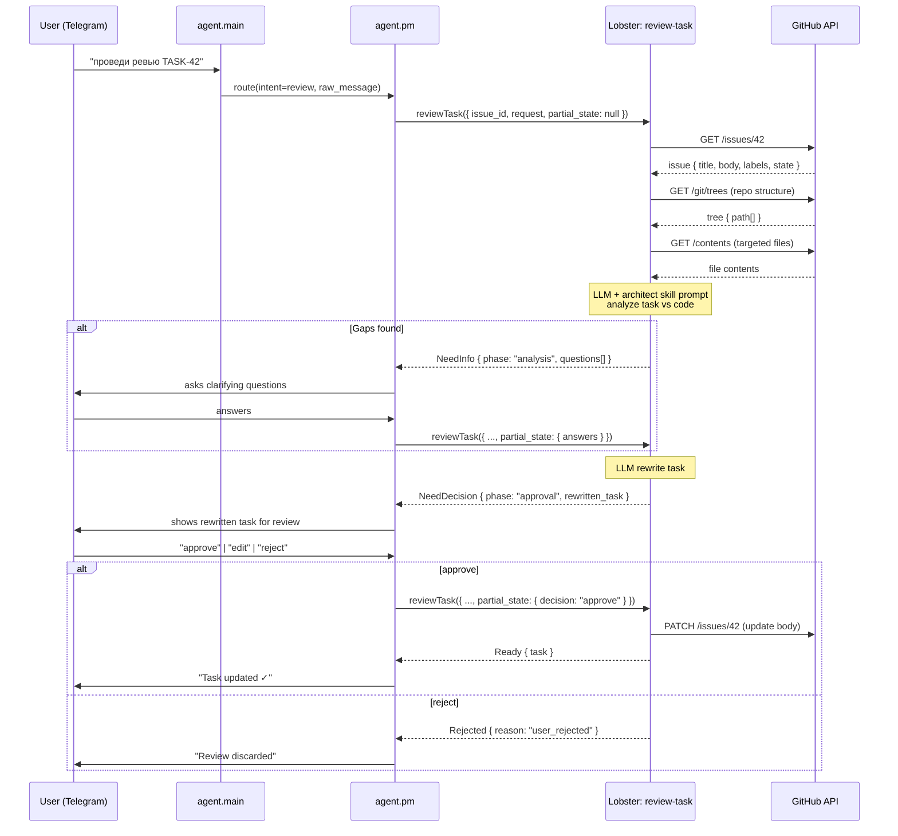
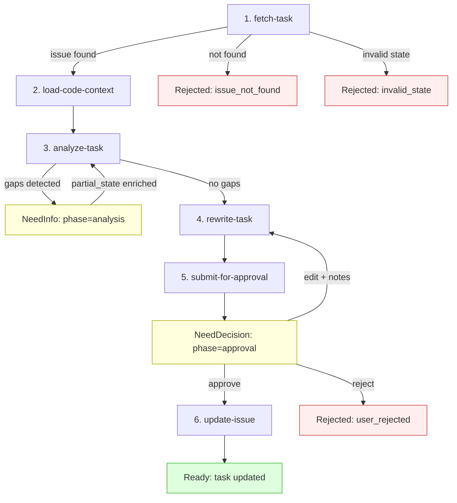
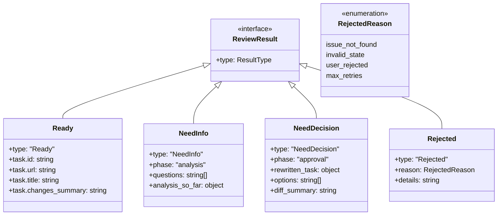
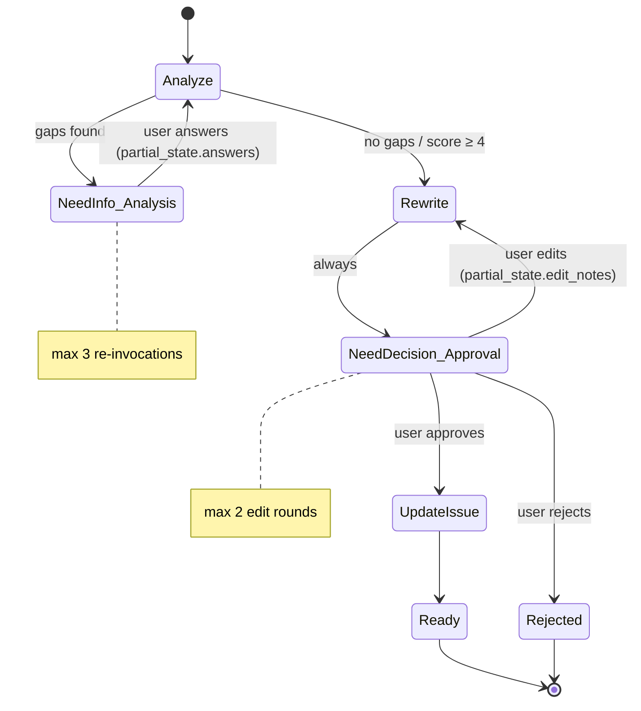
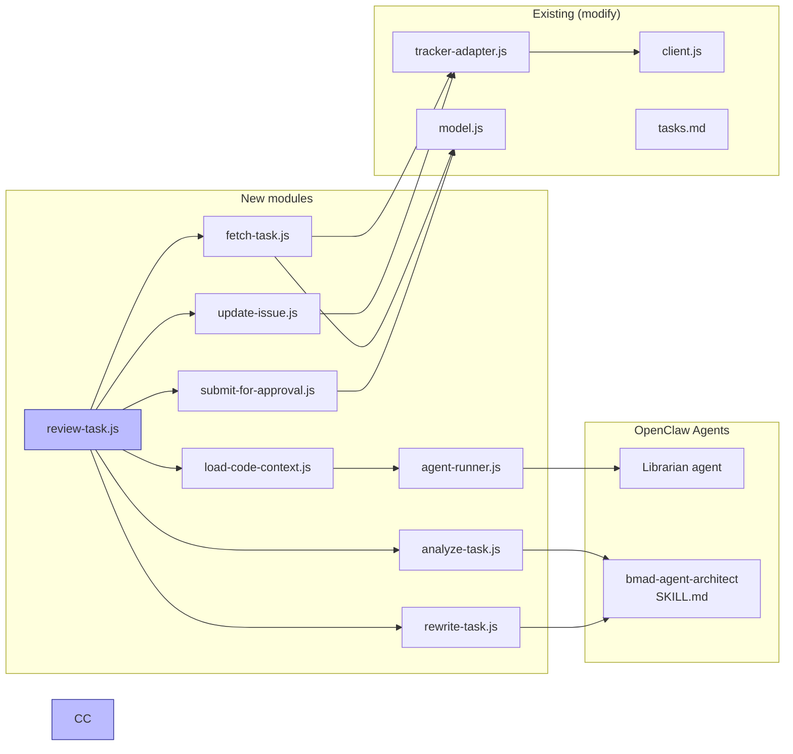

# Feature: Architecture Review Task

**Pipeline:** `review-task`
**Runtime:** Lobster
**Version:** 0.1 (draft)
**Status:** Proposal

---

## Summary

New Lobster workflow that takes an existing GitHub issue, loads project code context, applies architectural analysis (via the `bmad-agent-architect` skill prompt), clarifies gaps with the user, rewrites the task with technical depth, and sends the result back for approval before updating the issue.

---

## Motivation

Current `create-task` pipeline converts natural language into a structured issue, but the result is a *product-level* description — it lacks architectural context, affected components, technical risks, and acceptance criteria grounded in the actual codebase. A separate review workflow fills this gap: it takes an existing issue (Draft or Backlog) and enriches it into an implementation-ready specification.

---

## High-Level Flow



---

## Pipeline Steps



---

## Step Specifications

### Step 1: `fetch-task`

**Type:** Deterministic
**Reuse:** `tracker.fetchIssue(id)` from existing `tracker-adapter.js`

**Input:**
- `issue_id: string` — parsed from user message by agent.pm or extracted by LLM
- `deps.tracker` — GitHub tracker adapter

**Output:**
- `issue: { id, title, body, state, labels[] }`

**Early exits:**
- `Rejected(issue_not_found)` — issue does not exist or API error
- `Rejected(invalid_state)` — issue state is `Done` or `InReview` (already past the point where review makes sense)

**Changes to tracker-adapter:** extend `fetchIssue()` to also return `body` (issue description). Currently returns `{ id, title, state, labels }` — needs to include `body` from `issue.body`.

### Step 2: `load-code-context`

**Type:** Agent-delegated (OpenClaw Librarian agent)
**Agent:** `openclaw/Librarian/` — code context scout
**Runner:** `lobster/lib/openclaw/agent-runner.js`

**Purpose:** Build a code context object that the LLM can use to understand the project's architecture. Delegates the actual file discovery and selection to the Librarian agent, which explores the repo using multi-hop reading.

**How it works:**
1. Pipeline builds a task prompt with issue title, body, and repo coordinates
2. Spawns the Librarian agent via `openclaw agent --agent librarian --local`
3. Librarian explores the repo: reads structure → follows references → verifies relevance
4. Librarian returns structured JSON: `{ repoTree, files, totalSize }`
5. Pipeline validates and uses the result

**Advantages over deterministic keyword matching:**
- Semantic understanding: agent reads file contents to judge relevance, not just paths
- Multi-hop: follows import chains, README references, and doc links
- Adaptive: works on any language/framework without hardcoded patterns

**Constraints:**
- Max 15 files fetched (prevent rate limiting and context blowup)
- Max 50KB total content (truncate large files to first 200 lines)
- Tree listing is always included in full (paths only, lightweight)

**Output:**
- `codeContext: { repoTree: string[], files: FileContent[], totalSize: number }`

### Step 3: `analyze-task`

**Type:** LLM call (primary analysis step)
**System prompt:** Content of `bmad-agent-architect/SKILL.md` (Winston persona) + structured instructions

**Input:**
- `issue: { title, body }` — from step 1
- `codeContext` — from step 2
- `partial_state.answers` — user answers from previous NeedInfo loop (if any)

**LLM prompt structure:**
```
[system: architect skill content]

You are reviewing a task for implementation readiness.

## Task
Title: {title}
Description: {body}

## Project Code Context
Repository tree:
{tree listing}

Key files:
{file contents}

## Previous Clarifications
{answers from partial_state, if any}

## Instructions
Analyze this task and produce:
1. affected_components: string[] — files/modules that will need changes
2. technical_gaps: string[] — questions that must be answered before implementation
3. risks: string[] — architectural risks or concerns
4. dependencies: string[] — external/internal dependencies
5. suggested_approach: string — high-level implementation approach
6. completeness_score: 1-5 — how ready is this task for implementation

If technical_gaps is non-empty, the pipeline will ask the user.
If completeness_score >= 4 and no gaps, proceed to rewrite.
```

**Output:**
- `analysis: { affected_components, technical_gaps, risks, dependencies, suggested_approach, completeness_score }`

**Early exit:**
- `NeedInfo(phase="analysis")` — when `technical_gaps` is non-empty

### Step 4: `rewrite-task`

**Type:** LLM call (generation step)
**System prompt:** Same architect skill content

**Input:**
- Original `issue`
- `analysis` from step 3
- `codeContext` from step 2
- `partial_state.edit_notes` — user feedback from rejected approval (if re-entering)

**LLM prompt produces a rewritten task with sections:**
```markdown
## Summary
{1-2 sentence technical summary}

## Technical Context
{affected components, architecture notes}

## Implementation Approach
{step-by-step technical approach}

## Acceptance Criteria
- [ ] {criterion 1}
- [ ] {criterion 2}
...

## Risks & Dependencies
{risks and mitigation}

## Affected Components
{list of files/modules}

---
<details><summary>Original Description</summary>
{original issue body}
</details>
```

**Output:**
- `rewritten: { title, body, sections }`

### Step 5: `submit-for-approval`

**Type:** Deterministic (formatting + result construction)

**Always returns:** `NeedDecision(phase="approval")` with the rewritten task for the user to review.

**Options presented:**
- `approve` — accept and update the issue
- `edit` — provide feedback, re-enter step 4
- `reject` — discard the review

### Step 6: `update-issue`

**Type:** Deterministic (GitHub API call)
**New method in tracker-adapter:** `updateIssue(id, { body, labels? })`

**Actions:**
1. PATCH the issue body with the rewritten content
2. Add label `reviewed:architecture` to indicate the review was done
3. Optionally transition state (if configured): Draft → Backlog

**Output:**
- `Ready({ task: { id, url, title, changes_summary } })`

---

## Typed Results Contract



---

## PM Behavior Contract

| Result | agent.pm action |
|--------|----------------|
| `Ready` | Report success. Send link to updated issue. Done. |
| `NeedInfo(analysis)` | Present `questions[]` to user. Collect answers. Re-invoke with `partial_state.answers`. |
| `NeedDecision(approval)` | Format `rewritten_task` as readable message. Present options. On "approve" → re-invoke with `partial_state.decision="approve"`. On "edit" → collect notes, re-invoke with `partial_state.edit_notes`. On "reject" → re-invoke with `partial_state.decision="reject"`. |
| `Rejected` | Explain reason. No re-invoke. |

### Clarification Loop



**Loop limits:**
- Analysis clarification: max 3 re-invocations (same as create-task)
- Approval edit rounds: max 2 (after that, suggest creating a new task)
- Counter resets on fresh user-initiated review (not re-invokes)

---

## File Inventory

| File | Action | Description |
|------|--------|-------------|
| `lobster/workflows/review-task.lobster` | Create | Pipeline declaration |
| `lobster/lib/tasks/review-task.js` | Create | Pipeline orchestrator |
| `lobster/lib/tasks/steps/fetch-task.js` | Create | Step 1 (wraps tracker.fetchIssue) |
| `lobster/lib/tasks/steps/load-code-context.js` | Create | Step 2 (spawns Librarian agent) |
| `lobster/lib/tasks/steps/analyze-task.js` | Create | Step 3 (LLM + architect prompt) |
| `lobster/lib/tasks/steps/rewrite-task.js` | Create | Step 4 (LLM task rewrite) |
| `lobster/lib/tasks/steps/submit-for-approval.js` | Create | Step 5 (format NeedDecision) |
| `lobster/lib/tasks/steps/update-issue.js` | Create | Step 6 (PATCH issue) |
| `lobster/lib/openclaw/agent-runner.js` | Create | OpenClaw agent invocation utility |
| `openclaw/Librarian/AGENTS.md` | Create | Librarian agent system prompt |
| `openclaw/Librarian/SOUL.md` | Create | Librarian agent persona |
| `openclaw/agents/librarian/agent/` | Create | Librarian agent runtime config |
| `lobster/lib/github/tracker-adapter.js` | Modify | Add `updateIssue()`, extend `fetchIssue()` with body |
| `lobster/lib/github/client.js` | Modify | Add `updateIssue()` |
| `lobster/lib/tasks/model.js` | Modify | Add review-specific constants |
| `lobster/skills/tasks.md` | Modify | Add "review task" intent |
| `openclaw/openclaw.json` | Modify | Register Librarian agent |
| `test/tasks/review-task.test.js` | Create | Pipeline tests (mocks agentRunner) |

---

## Dependencies Between Components



---

## Assumptions

> These are unresolved design decisions recorded as working assumptions.
> Each must be validated or revised before implementation.

### A1: Code access via Librarian agent, not direct GitHub API

**Assumption:** Step 2 delegates file discovery to the Librarian OpenClaw agent, which uses its own tools (file reading) to explore the repository. The pipeline does not make direct GitHub API calls for code context.

**Rationale:** Agent-based exploration provides semantic understanding — it reads file contents to judge relevance, follows import chains, and adapts to any language/framework. This replaces the brittle keyword-matching heuristic.

**Risk:** Slower than direct API calls (~5-15s vs ~1-2s). Non-deterministic — agent may select different files on repeat runs. Requires running OpenClaw gateway or `--local` mode.

**Alternative:** Fall back to deterministic keyword matching if agent is unavailable.

### A2: Architect skill loaded as system prompt, not as autonomous agent

**Assumption:** Steps 3 and 4 inject the content of `bmad-agent-architect/SKILL.md` as a system prompt prefix into the LLM call. The LLM does not run as an interactive agent — it produces structured JSON output in a single call.

**Rationale:** Keeps pipeline deterministic. Agent-mode would require session management, multi-turn orchestration, and unpredictable step counts.

**Risk:** Single-shot analysis may be less thorough than interactive architect session. Complex tasks may need deeper exploration.

**Alternative:** Launch a separate Claude session with the architect skill active, pass it structured input, collect structured output. Higher quality, but breaks the typed-result determinism contract.

### A3: Issue must be in Draft or Backlog state for review

**Assumption:** Only issues in `Draft` or `Backlog` state can be reviewed. Issues already in `Ready`, `InProgress`, `InReview`, or `Done` produce a `Rejected` result.

**Rationale:** Review is a pre-implementation activity. Reviewing a task already in progress creates confusion about what the "current" spec is.

**Risk:** Users may want to review tasks in any state (e.g., re-review before closing).

**Alternative:** Allow review in any state except `Done`. Add a `re-review` flag.

### A4: Rewrite replaces issue body, original preserved in collapsed section

**Assumption:** The rewritten task entirely replaces the issue body. The original description is preserved inside a `<details>` HTML block at the bottom.

**Rationale:** Clean primary view. History preserved for traceability. GitHub renders `<details>` natively.

**Risk:** Repeated reviews stack collapsed sections. Need a strategy for multi-review cleanup.

**Alternative:** Use GitHub issue comments for review output instead of body replacement. Original body stays untouched.

### A5: LLM model for review steps is the same as `deps.llm`

**Assumption:** The existing `deps.llm` dependency (same one used by `parseRequest` in create-task) is used for analyze and rewrite steps.

**Rationale:** Single LLM contract keeps things simple.

**Risk:** `deps.llm` might point to a smaller/cheaper model optimized for field extraction. Architecture review needs a capable model (Opus or Sonnet-class).

**Alternative:** Introduce `deps.llm_heavy` or a model override in pipeline config. Step-level model selection.

### A6: File relevance determined by Librarian agent (multi-hop exploration)

**Assumption:** The Librarian agent explores the repo using multi-hop reading: reads directory structure → follows references and imports → reads candidate files → judges relevance based on content.

**Rationale:** Dramatically better file selection than keyword matching. The agent understands semantics, follows cross-references, and can read inside files to verify relevance.

**Risk:** Non-deterministic output. Agent may hallucinate or return poor selections. Costs extra tokens (its own LLM call).

**Alternative:** Hybrid approach — agent explores but pipeline validates the selection against hard constraints (max files, max size).

### A7: Max 15 files / 50KB total code context

**Assumption:** Hard limits on code context size to prevent LLM context overflow and API rate limiting.

**Rationale:** Most tasks touch 3-8 files. 50KB is roughly 1500 lines — enough for architectural understanding without drowning the model.

**Risk:** Large refactoring tasks may need broader context. Monorepo structures may require cross-package awareness.

**Alternative:** Dynamic limits based on LLM context window size. Or: tiered approach (summary pass → targeted deep dive).

### A8: `reviewed:architecture` label added on successful review

**Assumption:** A new label `reviewed:architecture` is added to the issue after successful review, as a signal that the task has been architecturally vetted.

**Rationale:** Makes review status visible in GitHub project boards and queries.

**Risk:** Label proliferation. Need to define the full label taxonomy.

**Alternative:** Use a checkbox in the issue body or a GitHub Project v2 custom field.

### A9: Clarification questions go to the original user via Telegram

**Assumption:** When the pipeline returns `NeedInfo`, agent.pm routes the questions back through the same Telegram channel to the user who initiated the review.

**Rationale:** Follows existing create-task flow where clarifications go back to the requester.

**Risk:** The reviewer (user) may not have all the answers — they might need to loop in the original task author or a team member.

**Alternative:** Allow specifying a different responder. Or: skip clarification if gaps are non-critical (completeness_score >= 3) and note them as open questions in the rewritten task.

### A10: No automatic state transition after review

**Assumption:** Successful review does not change the issue state (Draft stays Draft, Backlog stays Backlog). State transitions remain a separate explicit action via `approve-task`.

**Rationale:** Separation of concerns. Review enriches content; approval transitions state. User should decide when to promote.

**Risk:** Extra step for the user. May feel redundant if they just approved the review.

**Alternative:** Optional auto-promote flag: `partial_state.auto_approve: true` triggers Draft → Backlog after successful review.
