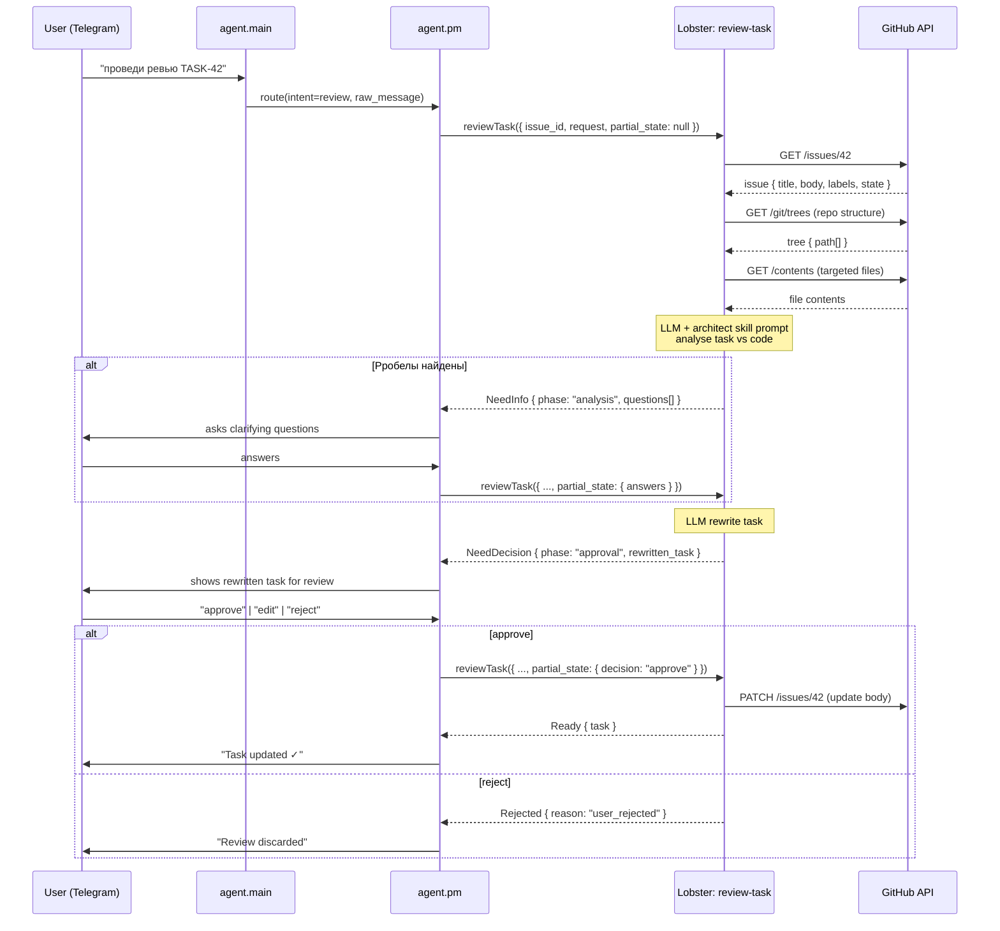
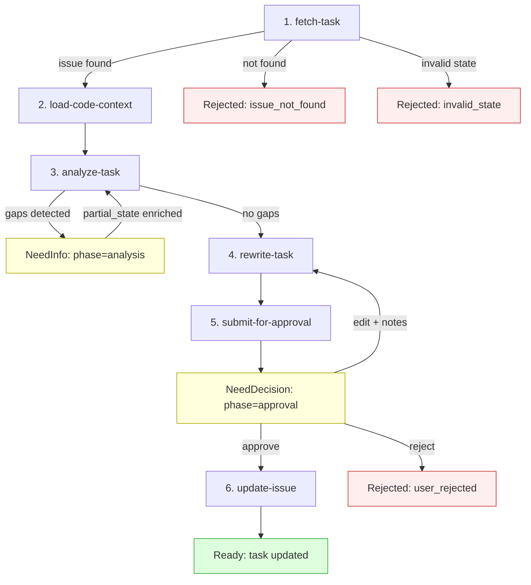
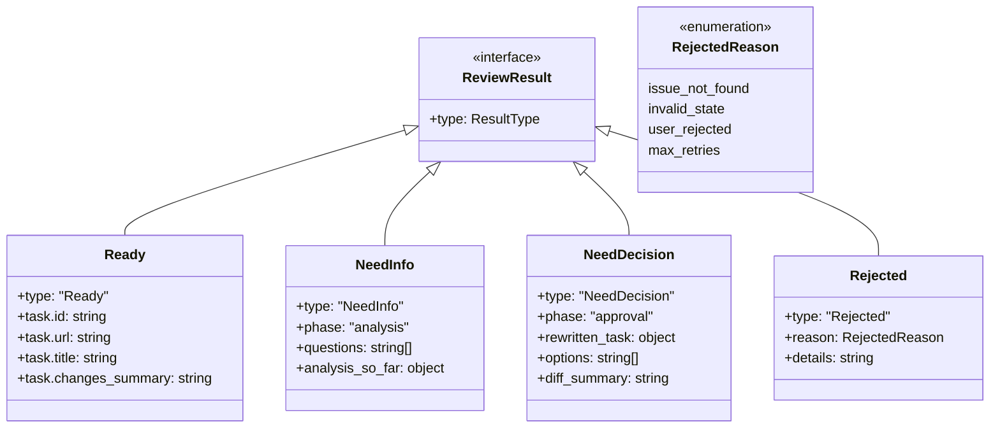
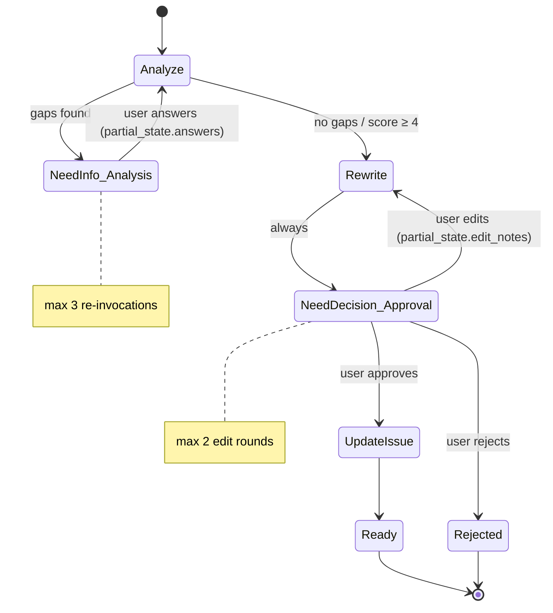
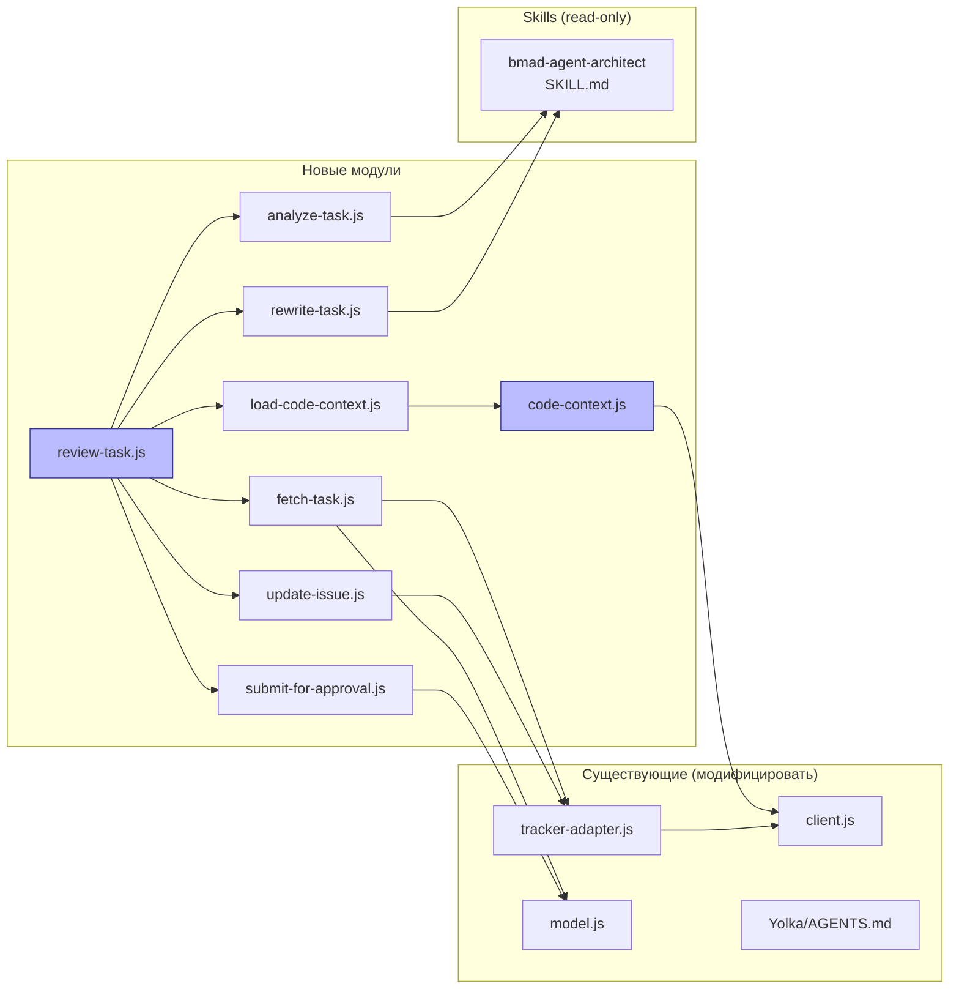

# Фича: Архитектурный ревью задачи

**Pipeline:** `review-task`
**Runtime:** Lobster
**Version:** 0.1 (черновик)
**Статус:** Предложение

---

## Краткое описание

Новый workflow Lobster, который берёт существующий GitHub issue, загружает контекст кода проекта, применяет архитектурный анализ (через prompt `bmad-agent-architect` skill), прояснит пробелы с пользователем, переписывает задачу с технической глубиной и отправляет результат на одобрение перед обновлением issue.

---

## Мотивация

Текущий pipeline `create-task` преобразует естественный язык в структурированный issue, но результат — *продуктовое* описание, лишённое архитектурного контекста, затронутых компонентов, технических рисков и критериев приёма, привязанных к реальному кодовой базе. Отдельный workflow ревью заполняет этот разрыв: он берёт существующий issue (Draft или Backlog) и обогащает его в готовую-к-реализации спецификацию.

---

## High-Level Flow



---

## Шаги Pipeline



---

## Спецификация шагов

### Шаг 1: `fetch-task`

**Тип:** Детерминированный
**Переиспользование:** `tracker.fetchIssue(id)` из существующего `tracker-adapter.js`

**Вход:**
- `issue_id: string` — спарсено из сообщения пользователя agent.pm или извлечено LLM
- `deps.tracker` — GitHub tracker adapter

**Выход:**
- `issue: { id, title, body, state, labels[] }`

**Ранние выходы:**
- `Rejected(issue_not_found)` — issue не существует или ошибка API
- `Rejected(invalid_state)` — state issue это `Done` или `InReview` (уже прошёл точку где ревью имеет смысл)

**Изменения в tracker-adapter:** расширить `fetchIssue()` чтобы также возвращать `body` (описание issue). Сейчас возвращает `{ id, title, state, labels }` — нужно включить `body` из `issue.body`.

### Шаг 2: `load-code-context`

**Тип:** Детерминированный (GitHub API вызовы)
**Новый модуль:** `lobster/lib/github/code-context.js`

**Цель:** Построить объект контекста кода, который LLM сможет использовать для понимания архитектуры проекта.

**Подшаги:**
1. **Загрузить дерево репо** — `GET /repos/{owner}/{repo}/git/trees/{branch}?recursive=1`
2. **Отфильтровать релевантные файлы** — эвристический отбор:
   - Документы архитектуры: `**/architecture*.md`, `**/ADR-*`, `**/design-*.md`
   - Манифесты пакетов: `package.json`, `go.mod`, `Cargo.toml`, и т.д.
   - Точки входа: `index.js`, `main.*`, `app.*`
   - Файлы, совпадающие с ключевыми словами из title/body issue
3. **Загрузить содержимое файлов** — `GET /repos/{owner}/{repo}/contents/{path}` для выбранных файлов (base64 → utf-8)
4. **Собрать контекст** — `{ tree: string[], files: { path, content }[], summary: string }`

**Ограничения:**
- Максимум 15 файлов загружено (предотвращение rate limiting и переполнения контекста)
- Максимум 50KB всего контента (обрезать большие файлы до первых 200 строк)
- Список дерева всегда включается в полном виде (только пути, лёгкий)

**Выход:**
- `codeContext: { repoTree: string[], files: FileContent[], totalSize: number }`

### Шаг 3: `analyze-task`

**Тип:** LLM вызов (основной шаг анализа)
**System prompt:** Содержимое `bmad-agent-architect/SKILL.md` (персона Winston) + структурированные инструкции

**Вход:**
- `issue: { title, body }` — из шага 1
- `codeContext` — из шага 2
- `partial_state.answers` — ответы пользователя из предыдущего NeedInfo loop (если есть)

**Структура LLM prompt:**
```
[system: architect skill content]

You are reviewing a task for implementation readiness.

## Task
Title: {title}
Description: {body}

## Project Code Context
Repository tree:
{tree listing}

Key files:
{file contents}

## Previous Clarifications
{answers from partial_state, if any}

## Instructions
Analyze this task and produce:
1. affected_components: string[] — files/modules that will need changes
2. technical_gaps: string[] — questions that must be answered before implementation
3. risks: string[] — architectural risks or concerns
4. dependencies: string[] — external/internal dependencies
5. suggested_approach: string — high-level implementation approach
6. completeness_score: 1-5 — how ready is this task for implementation

If technical_gaps is non-empty, the pipeline will ask the user.
If completeness_score >= 4 and no gaps, proceed to rewrite.
```

**Выход:**
- `analysis: { affected_components, technical_gaps, risks, dependencies, suggested_approach, completeness_score }`

**Ранний выход:**
- `NeedInfo(phase="analysis")` — когда `technical_gaps` не пуст

### Шаг 4: `rewrite-task`

**Тип:** LLM вызов (шаг генерации)
**System prompt:** То же содержимое architect skill

**Вход:**
- Оригинальный `issue`
- `analysis` из шага 3
- `codeContext` из шага 2
- `partial_state.edit_notes` — обратная связь пользователя из отклонённого одобрения (если повторный вход)

**LLM prompt производит переписанную задачу с секциями:**
```markdown
## Summary
{1-2 sentence technical summary}

## Technical Context
{affected components, architecture notes}

## Implementation Approach
{step-by-step technical approach}

## Acceptance Criteria
- [ ] {criterion 1}
- [ ] {criterion 2}
...

## Risks & Dependencies
{risks and mitigation}

## Affected Components
{list of files/modules}

---
<details><summary>Original Description</summary>
{original issue body}
</details>
```

**Выход:**
- `rewritten: { title, body, sections }`

### Шаг 5: `submit-for-approval`

**Тип:** Детерминированный (форматирование + конструирование результата)

**Всегда возвращает:** `NeedDecision(phase="approval")` с переписанной задачей для пользователя на проверку.

**Представленные варианты:**
- `approve` — принять и обновить issue
- `edit` — предоставить обратную связь, повторить шаг 4
- `reject` — отменить ревью

### Шаг 6: `update-issue`

**Тип:** Детерминированный (GitHub API вызов)
**Новый метод в tracker-adapter:** `updateIssue(id, { body, labels? })`

**Действия:**
1. PATCH body issue переписанным содержимым
2. Добавить label `reviewed:architecture` чтобы указать что ревью было сделано
3. Опционально изменить state (если настроено): Draft → Backlog

**Выход:**
- `Ready({ task: { id, url, title, changes_summary } })`

---

## Типированный контракт результатов



---

## Контракт поведения PM

| Result | Действие agent.pm |
|--------|-------------------|
| `Ready` | Сообщить об успехе. Отправить link на обновленный issue. Готово. |
| `NeedInfo(analysis)` | Представить `questions[]` пользователю. Собрать ответы. Re-invoke с `partial_state.answers`. |
| `NeedDecision(approval)` | Форматировать `rewritten_task` как читаемое сообщение. Представить варианты. На "approve" → re-invoke с `partial_state.decision="approve"`. На "edit" → собрать заметки, re-invoke с `partial_state.edit_notes`. На "reject" → re-invoke с `partial_state.decision="reject"`. |
| `Rejected` | Объяснить причину. No re-invoke. |

### Clarification Loop



**Лимиты loop:**
- Analysis clarification: максимум 3 re-invocations (как в create-task)
- Approval edit rounds: максимум 2 (после этого предложить создать новую задачу)
- Counter сбрасывается на новом инициированном пользователем ревью (не на re-invokes)

---

## Инвентарь файлов

| Файл | Действие | Описание |
|------|---------|----------|
| `lobster/workflows/review-task.lobster` | Создать | Декларация pipeline |
| `lobster/lib/tasks/review-task.js` | Создать | Оркестратор pipeline |
| `lobster/lib/tasks/steps/fetch-task.js` | Создать | Шаг 1 (обёрнут tracker.fetchIssue) |
| `lobster/lib/tasks/steps/load-code-context.js` | Создать | Шаг 2 (GitHub tree + чтение файлов) |
| `lobster/lib/tasks/steps/analyze-task.js` | Создать | Шаг 3 (LLM + architect prompt) |
| `lobster/lib/tasks/steps/rewrite-task.js` | Создать | Шаг 4 (LLM переписывание задачи) |
| `lobster/lib/tasks/steps/submit-for-approval.js` | Создать | Шаг 5 (форматирование NeedDecision) |
| `lobster/lib/tasks/steps/update-issue.js` | Создать | Шаг 6 (PATCH issue) |
| `lobster/lib/github/code-context.js` | Создать | Repo tree + file fetcher |
| `lobster/lib/github/tracker-adapter.js` | Модифицировать | Добавить `updateIssue()`, расширить `fetchIssue()` с body |
| `lobster/lib/github/client.js` | Модифицировать | Добавить `getTree()`, `getFileContent()`, `updateIssue()` |
| `lobster/lib/tasks/model.js` | Модифицировать | Добавить review-specific result schemas |
| `openclaw/Yolka/AGENTS.md` | Модифицировать | Добавить "review task" intent в таблицу маршрутизации |
| `test/tasks/review-task.test.js` | Создать | Pipeline тесты |
| `test/github/code-context.test.js` | Создать | Code context fetcher тесты |

---

## Зависимости между компонентами



---

## Assumptions (Допущения)

> Это нерешённые дизайн-решения, записанные как рабочие допущения.
> Каждое должно быть валидировано или пересмотрено перед реализацией.

### A1: Доступ к коду через GitHub Contents API, не локальная FS

**Допущение:** Lobster загружает код через GitHub REST API (tree endpoint + content reads), не из локального clone.

**Rationale:** Согласуется с текущей архитектурой — lobster говорит с GitHub, не с файловой системой. Избегает введения clone/pull механик.

**Риск:** Медленно для больших репо; подвержено rate limits (5000 req/hour authenticated). Может пропустить uncommitted changes.

**Альтернатива:** Локальный FS доступ если OpenClaw предоставляет workspace path. Требует нового `deps.workspace` контракта.

### A2: Architect skill загружен как system prompt, не как автономный агент

**Допущение:** Шаги 3 и 4 инъектируют содержимое `bmad-agent-architect/SKILL.md` как system prompt prefix в LLM вызов. LLM не запускается как интерактивный агент — он производит структурированный JSON output в одном вызове.

**Rationale:** Сохраняет pipeline детерминированным. Agent-mode требовал бы session management, multi-turn orchestration, и непредсказуемое количество шагов.

**Риск:** Single-shot анализ может быть менее thorough чем интерактивная architect сессия. Комплексные задачи могут требовать более глубокого исследования.

**Альтернатива:** Запустить отдельную Claude сессию с активированным architect skill, передать ей структурированный input, собрать структурированный output. Выше качество, но нарушает типированный результат детерминизм контракт.

### A3: Issue должен быть в Draft или Backlog state для ревью

**Допущение:** Только issues в `Draft` или `Backlog` state могут быть reviewed. Issues уже в `Ready`, `InProgress`, `InReview`, или `Done` производят `Rejected` результат.

**Rationale:** Ревью — pre-implementation активность. Reviewing задачи уже в progress создаёт confusion о том какая "текущая" спек.

**Риск:** Пользователи могут захотеть ревьювить задачи в любом state (напр., re-review перед closing).

**Альтернатива:** Позволить ревью в любом state кроме `Done`. Добавить `re-review` флаг.

### A4: Переписанное заменяет body issue, оригинал сохранён в collapsed секции

**Допущение:** Переписанная задача полностью заменяет body issue. Оригинальное описание сохранено внутри `<details>` HTML блока внизу.

**Rationale:** Чистый primary view. История сохранена для traceability. GitHub renderит `<details>` natively.

**Риск:** Повторённые ревью stack collapsed секции. Нужна стратегия для multi-review cleanup.

**Альтернатива:** Использовать GitHub issue comments для review output вместо body replacement. Оригинальный body остаётся untouched.

### A5: LLM model для review шагов то же самое что `deps.llm`

**Допущение:** Существующая `deps.llm` зависимость (то же самое что используется parseRequest в create-task) используется для analyze и rewrite шагов.

**Rationale:** Единый LLM контракт сохраняет вещи простыми.

**Риск:** `deps.llm` может указывать на меньший/дешёвый model оптимизированный для field extraction. Architecture ревью требует capable model (Opus или Sonnet-class).

**Альтернатива:** Introduce `deps.llm_heavy` или model override в pipeline config. Step-level model selection.

### A6: File relevance heuristic это keyword-based + структурные паттерны

**Допущение:** `load-code-context` выбирает файлы по: (a) структурные паттерны (architecture docs, entry points, configs), и (b) keyword matching между issue title/body и file paths.

**Rationale:** Просто, детерминированно, не LLM требуется для file selection.

**Риск:** Keyword matching может пропустить релевантные файлы (semantic gap). Структурные паттерны language-specific.

**Альтернатива:** Two-pass подход: первый pass загружает tree + structural files, LLM picks дополнительные файлы базировано на task description. Добавляет один ещё LLM вызов но dramatically улучшает relevance.

### A7: Максимум 15 файлов / 50KB всего code context

**Допущение:** Hard лимиты на code context size чтобы предотвратить LLM context overflow и API rate limiting.

**Rationale:** Большинство задач touchают 3-8 файлов. 50KB — примерно 1500 строк — достаточно для архитектурного понимания без утопления модели.

**Риск:** Большие refactoring задачи могут требовать более широкий контекст. Monorepo структуры могут требовать cross-package awareness.

**Альтернатива:** Dynamic лимиты базировано на LLM context window size. Или: tiered подход (summary pass → targeted deep dive).

### A8: `reviewed:architecture` label добавлен на успешный ревью

**Допущение:** Новый label `reviewed:architecture` добавлен к issue после успешного ревью, как сигнал что задача была architecturally vetted.

**Rationale:** Makes review status видим в GitHub project boards и queries.

**Риск:** Label proliferation. Need определить полную label taxonomy.

**Альтернатива:** Используй checkbox в issue body или GitHub Project v2 custom field.

### A9: Clarification вопросы идут к оригинальному пользователю через Telegram

**Допущение:** Когда pipeline возвращает `NeedInfo`, agent.pm маршрутизирует вопросы обратно через тот же Telegram channel пользователю который инициировал ревью.

**Rationale:** Follows существующий create-task flow где clarifications идут обратно к requester.

**Риск:** Reviewer (пользователь) может не иметь все ответы — они могут требовать loop in оригинального task author или team member.

**Альтернатива:** Allow указания разного responder. Или: skip clarification если gaps non-critical (completeness_score >= 3) и note их как open questions в переписанной задаче.

### A10: Никаких автоматических state transitions после ревью

**Допущение:** Успешный ревью не меняет issue state (Draft остаётся Draft, Backlog остаётся Backlog). State transitions остаются отдельное explicit action через `approve-task`.

**Rationale:** Separation of concerns. Ревью обогащает content; approval transitions state. Пользователь должен решить когда promote.

**Риск:** Extra шаг для пользователя. May feel redundant если они just approveили ревью.

**Альтернатива:** Optional auto-promote флаг: `partial_state.auto_approve: true` triggers Draft → Backlog после успешного ревью.
