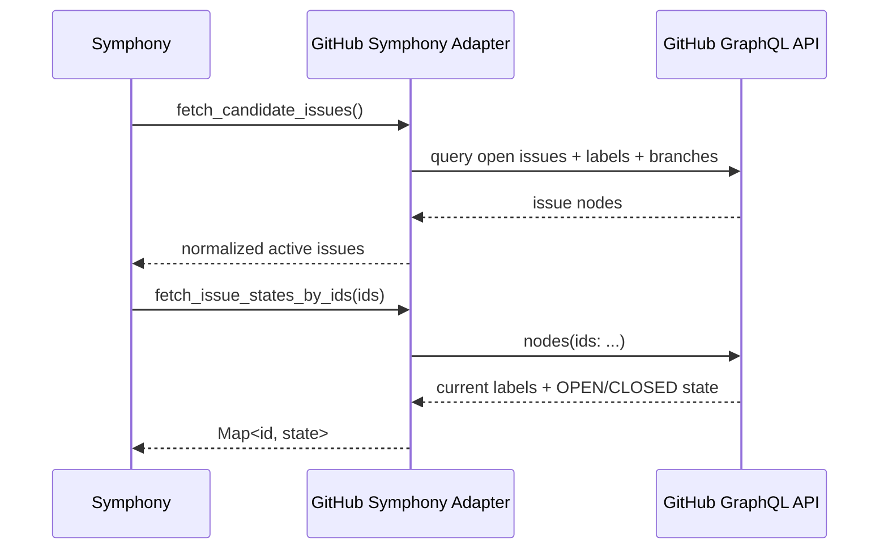

# Integration: Symphony

This repository contains the GitHub-side adapter layer for Symphony, not the full Symphony runtime itself.

## Current Implementation Status

| Area | Status | Notes |
|---|---|---|
| GitHub issue normalization for Symphony | Implemented | In `lobster/lib/github/symphony-adapter.js` |
| `tracker.kind: github` config parsing | Implemented | In `lobster/lib/github/tracker-config.js` |
| Candidate issue polling contract | Implemented | `fetch_candidate_issues()` |
| Running issue reconciliation | Implemented | `fetch_issue_states_by_ids()` |
| Terminal issue lookup | Implemented | `fetch_issues_by_states()` |
| `github_graphql` agent tool | Not implemented here | Documented earlier as planned, not present in runtime code |

## Why Symphony Needs a Separate Adapter

The `create_task` tracker adapter only needs two operations:

- fetch recent tasks
- create a new issue

Symphony needs a richer model:

- candidate discovery
- current state reconciliation
- terminal state lookup
- label-driven state normalization
- issue metadata like labels, branches, timestamps, and dependencies

## State Model

Symphony uses label-based workflow states because GitHub issues only have native `OPEN` and `CLOSED` states.

| Label | Meaning |
|---|---|
| `status:todo` | Ready for pickup |
| `status:in-progress` | Agent is working |
| `status:in-review` | PR opened, awaiting human review |
| `status:rework` | Returned for more work |
| `status:done` | Terminal success |
| `status:cancelled` | Terminal cancellation |

If multiple status labels exist, the adapter picks the first one alphabetically and can emit a warning via `onWarning`.

## Operational Flow



## Configuration Contract

Example config block accepted by `parseGitHubTrackerConfig()`:

```yaml
tracker:
  kind: github
  repo: owner/repo
  api_key: $GITHUB_TOKEN
  label_prefix: status
  active_states:
    - status:todo
    - status:in-progress
  terminal_states:
    - status:done
    - status:cancelled
```

## Files to Read

| Path | Purpose |
|---|---|
| `lobster/lib/github/symphony-adapter.js` | Normalization, label extraction, GraphQL paging |
| `lobster/lib/github/tracker-config.js` | Config parsing and environment variable resolution |
| `test/github/symphony-adapter.test.js` | Concrete behavior and edge-case coverage |