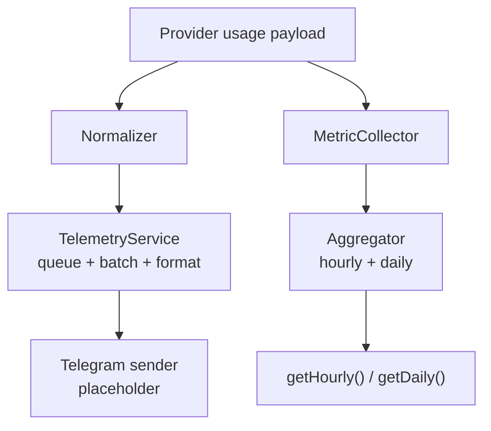

# Integration: Telemetry and Usage

The repository contains two observability-oriented building blocks:

1. Session telemetry reporting.
2. In-memory request usage aggregation.

They are related, but currently implemented as separate modules.

## Observability Paths

## Telemetry Path

### Components

| Component | Responsibility |
|---|---|
| `agent-wrapper.js` | High-level hooks: `onSuccess`, `onError`, `flush` |
| `normalizer.js` | Converts provider-specific payloads into `{ session, usage, error? }` |
| `service.js` | Queues events, batches by size or timeout, formats Telegram messages |

### Current behavior

- Queue flushes when batch size is reached or timeout expires.
- Errors in telemetry sending are swallowed after logging.
- `flush()` is available for tests and graceful shutdown scenarios.
- `_sendTelegram()` is still a placeholder, so the transport integration is incomplete.

## Usage Aggregation Path

### Components

| Component | Responsibility |
|---|---|
| `aggregator.js` | 60-minute sliding window plus current UTC day aggregate |
| `collector.js` | Small facade for `record()`, `getHourly()`, `getDaily()` |

### Aggregation model

| Window | Stored values |
|---|---|
| Hourly | Total tokens, average context %, request count |
| Daily | Total tokens, average context %, request count, unique session count |

## Environment Controls

| Variable | Effect |
|---|---|
| `TELEMETRY_DISABLED=true` | Disables the telemetry singleton in `agent-wrapper.js` |
| `TELEMETRY_DEBUG=true` | Enables debug logging in `TelemetryService` |

## Practical Caveats

1. Telemetry reporting and usage aggregation are not auto-wired together in this repo.
2. Aggregation is intentionally zero-persistence and resets on restart.
3. Telegram reporting is structurally ready but not connected to a real sender yet.