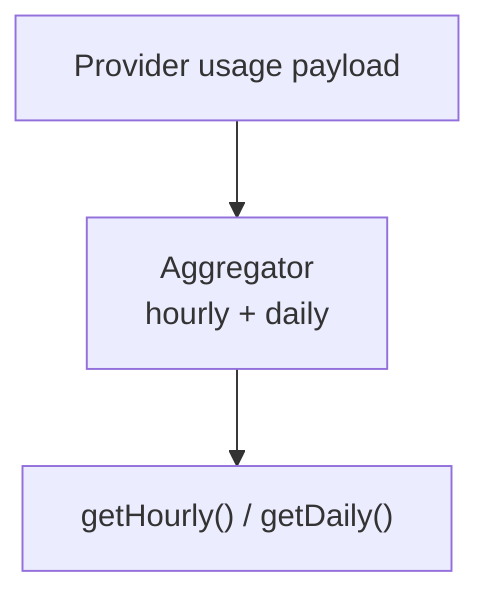

# Integration: Usage Aggregation

The repository contains an in-memory request usage aggregation module.

## Usage Aggregation Path

### Components

| Component | Responsibility |
|---|---|
| `aggregator.js` | 60-minute sliding window plus current UTC day aggregate |

### Aggregation model

| Window | Stored values |
|---|---|
| Hourly | Total tokens, average context %, request count |
| Daily | Total tokens, average context %, request count, unique session count |

## Practical Caveats

1. Aggregation is intentionally zero-persistence and resets on restart.
2. Backed by ADR-002 (in-memory circular buffer design).
