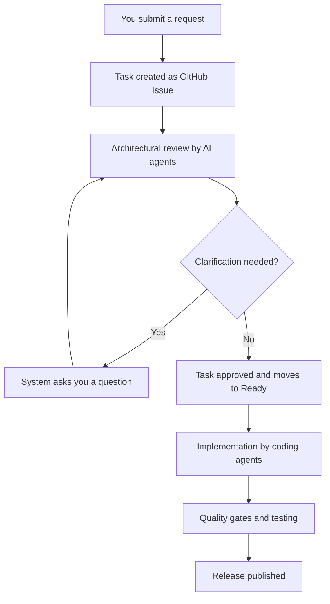

# What is YAAF

YAAF (Yet Another AI Factory) is an autonomous software development conveyor. You describe what you need in natural language — "Fix the login bug", "Add dark mode support" — and a team of AI agents carries the request through structuring, architectural review, implementation, testing, and release. The result is shipped software with passing tests, updated documentation, and a published release.

## How the Conveyor Works

The conveyor metaphor is literal: your idea enters one end, and a release exits the other. Between those endpoints, three systems collaborate to keep the line moving.

### OpenClaw — The Agent Platform

OpenClaw provides the AI agents that do the actual work. It handles multi-agent routing, session management, tool invocations, and inter-agent communication. When the conveyor needs an architectural analysis or a code-aware context lookup, OpenClaw dispatches the right agent (e.g., `librarian` for repository exploration) and returns structured results. You do not interact with OpenClaw directly — the conveyor calls it on your behalf.

### Lobster — The Workflow Engine

Lobster defines what happens at each stage of the conveyor. It runs typed, JSON-first pipelines with approval gates and LLM invocation steps. Each workflow (task creation, review, approval, publishing) is a Lobster pipeline composed of discrete steps. When a step produces a result — success, need for clarification, or rejection — Lobster routes the pipeline accordingly.

### Symphony — The Orchestrator

Symphony keeps the factory running around the clock. It polls your issue tracker (GitHub Issues), identifies tasks that need attention, dispatches agent runs per task, and manages retries and concurrency. Symphony ensures no task is lost — every issue is tracked through its lifecycle until completion or explicit rejection.

## High-Level Flow

## Zero-Intervention Execution

Once a task is accepted into the conveyor (state: Ready), no human action is required until the release is published. The system handles implementation, testing, documentation updates, and release creation autonomously.

There are exceptions. The system communicates via four typed results — **Ready**, **NeedInfo**, **NeedDecision**, and **Rejected** — described in detail in [task-lifecycle.md](task-lifecycle.md). When the system needs your input (a clarifying question, an approval decision, or a choice between options), it pauses the pipeline and asks. You respond, and the pipeline resumes from where it stopped.
