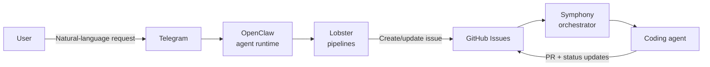

# Product Overview

YAAF is a repository for the execution layer of an AI-assisted delivery pipeline.

At its core, the repo does four things:

1. Accepts a natural-language task request and turns it into a structured GitHub issue.
2. Approves issues through a label-based state machine (Draft → Backlog → Ready).
3. Publishes issues directly to GitHub, including labels, assignees, milestones, and optional Project v2 placement.
4. Exposes adapters that let the same GitHub issues participate in a larger Symphony orchestration model.
5. Provides observability building blocks for telemetry reporting and in-memory usage aggregation.

## Current Capability Set

| Capability | Status | Notes |
|---|---|---|
| Conversational task creation (`create_task`) | Implemented | Main end-user flow in this repo |
| Task approval transitions (`approve_task`) | Implemented | Draft→Backlog→Ready via GitHub labels |
| Direct issue publishing (`publish_task`) | Implemented | Used when task fields are already structured |
| GitHub tracker adapter for `create_task` | Implemented | Resolves token and bridges to the pipeline contract |
| GitHub client (REST + GraphQL) | Implemented | No external npm dependencies |
| Symphony GitHub adapter core | Implemented | Candidate fetch, reconciliation, terminal cleanup lookup |
| Symphony agent write tool (`github_graphql`) | Planned | Spec exists, runtime tool is not yet present in this repo |
| Telegram telemetry sender | Partial | Batching/formatting exists, sender method is still a placeholder |

## End-to-End Shape

## What This Repository Owns

This repository owns the runtime modules under `lobster/lib/`, the Lobster workflow definitions, the GitHub adapters, and the tests that validate those modules.

It does not contain a full standalone application server, a production Telegram bot implementation, or the complete Symphony runtime. Those pieces are external systems or future integration layers.

## Design Intent

The code consistently prefers:

- Deterministic logic over repeated LLM involvement.
- Small single-purpose modules over wide frameworks.
- Typed pipeline results over free-form orchestration messages.
- Zero or near-zero runtime dependency surface.
- Test-first boundaries around every meaningful subsystem.

## Project Boundaries

| In repo | Outside repo |
|---|---|
| Task pipelines | Telegram transport implementation |
| GitHub client and adapters | Full Symphony orchestrator runtime |
| Telemetry formatting and batching | Live Telegram sender integration |
| Usage aggregation primitives | Persistent analytics backend |
| Tests for module behavior | End-to-end deployment automation |
