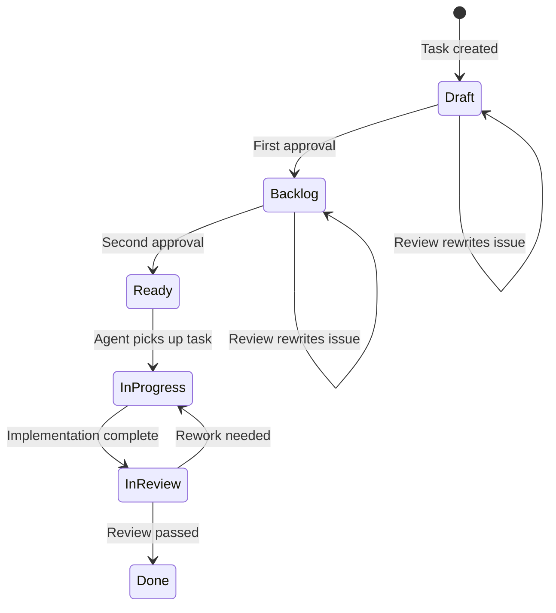

# How Tasks Move Through the System

Every piece of work in YAAF is a **task**, represented as a GitHub Issue. Tasks move through a defined set of states, tracked by `status:*` labels on the issue.

## Task States

| State | GitHub Label | What It Means |
|-------|-------------|---------------|
| **Draft** | `status:draft` | Created but not yet reviewed or approved. Initial state for all new tasks. |
| **Backlog** | `status:backlog` | Passed first approval. Structured and validated, waiting for final sign-off. |
| **Ready** | `status:ready` | Fully approved. Coding agents pick it up from here. |
| **InProgress** | `status:in-progress` | A coding agent is actively working on it. |
| **InReview** | `status:in-review` | Implementation complete, under QA/code review. |
| **Done** | `status:done` | Finished. Work merged/released. |

Additional labels recognized for project tracking: `status:todo`, `status:rework`, `status:cancelled`.

## State Diagram



## What Triggers Each Transition

| Transition | What Happens | Automatic? |
|------------|-------------|------------|
| → Draft | A new task is created and published as a GitHub Issue | Yes |
| Draft → Backlog | First approval — label swapped from `status:draft` to `status:backlog` | Requires approval |
| Backlog → Ready | Second approval — label swapped from `status:backlog` to `status:ready` | Requires approval |
| Ready → InProgress | Symphony dispatches a coding agent | Yes |
| InProgress → InReview | Agent completes implementation | Yes |
| InReview → Done | Review passes quality gates | Yes |

Only Draft → Backlog and Backlog → Ready require human action. Attempting to approve a task in any other state produces a Rejected result.

## Result Types

Every pipeline returns one of four typed results. Each workflow in [workflows.md](workflows.md) specifies which result types it can produce and under what conditions.

### Ready

The operation completed successfully.

```json
{
  "type": "Ready",
  "task": { "id": "42", "title": "Fix login bug", "previousState": "Draft", "newState": "Backlog" }
}
```

### NeedInfo

The system cannot proceed without your input — either required fields are missing or the analysis identified technical questions. Answer the questions and re-invoke the pipeline with `partial_state.answers`.

```json
{
  "type": "NeedInfo",
  "phase": "analysis",
  "questions": ["Which authentication provider is used?"]
}
```

### NeedDecision

The system reached a branching point that requires your explicit choice. Common scenarios: a potential duplicate was detected (proceed or cancel?), or a rewritten task is ready for your approval (approve, edit, or reject?). Your choice is fed back via `partial_state.decision` or `partial_state.dedup_decision`.

```json
{
  "type": "NeedDecision",
  "phase": "approval",
  "rewritten_task": { "title": "Fix login bug", "body": "## Summary\n..." },
  "options": ["approve", "edit", "reject"]
}
```

### Rejected

The operation was refused.

| Reason | Meaning | What to Do |
|--------|---------|------------|
| `missing_issue_id` | No issue ID provided | Include `issue_id` in the input |
| `invalid_transition` | Task state doesn't allow approval (only Draft and Backlog can be approved) | Check the task's current state |
| `invalid_state` | Task state doesn't allow review (only Draft and Backlog are reviewable) | Check the task's current state |
| `user_rejected` | You explicitly rejected the review | Intentional — start a new review if needed |
| `max_retries` | Exceeded 3 clarification rounds or 2 edit rounds | Start a new review with more detail upfront |
| `schema_violation` | Validation failed (empty title, title > 200 chars) | Fix the title and retry |
| `invalid_params` | Publish parameters invalid (missing project, bad format) | Check the error `details` array for specifics |
| `milestone_not_found` | Specified milestone doesn't exist in the repo | Verify the milestone name or create it first |

## GitHub Issues Integration

The system determines a task's state by reading its `status:*` labels (see the table above). If no status label exists, open issues default to Draft and closed issues default to Done.

When a task is created, it gets `status:draft`. When approved, the old label is removed and the new one is added — so the label always reflects the current state.

### Additional Labels

- **`type:bug`**, **`type:feature`**, **`type:chore`** — Task type, set during creation.
- **`reviewed:architecture`** — Added after a successful architectural review. The issue body now contains a structured specification.
- **`priority:N`** — Priority for Symphony dispatch ordering (e.g., `priority:1`).
