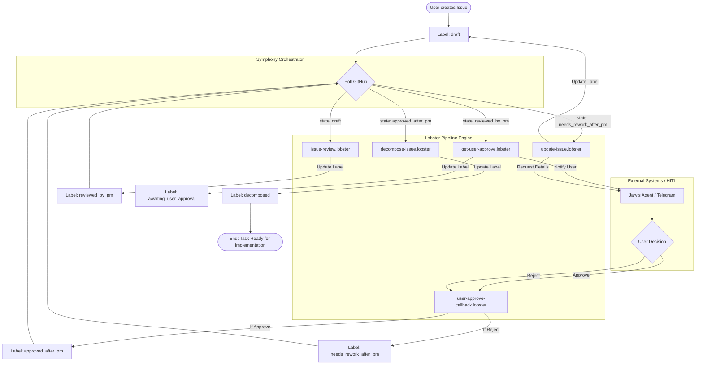

# YAAF — Полный воркфлоу процессов

Эта диаграмма описывает жизненный цикл задачи (GitHub Issue) и взаимодействие Symphony с воркфлоу Lobster.

### Описание этапов

1.  **Draft**: Начальное состояние. Система анализирует текст задачи и обогащает его контекстом проекта.
2.  **Review**: AI-агент проверяет задачу на полноту и соответствие стандартам.
3.  **HITL (Human-in-the-loop)**: Запрос на одобрение отправляется человеку в Telegram через агента Jarvis.
4.  **Approve/Reject**: 
    *   При одобрении задача уходит на **Декомпозицию** (разбиение на мелкие подзадачи).
    *   При отклонении задача возвращается на стадию **Draft** после сбора уточнений от пользователя.
5.  **Decomposed**: Финальное состояние архитектурного цикла. Задача готова к реализации разработчиком (или AI-разработчиком).
