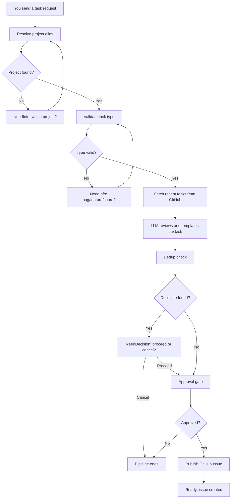
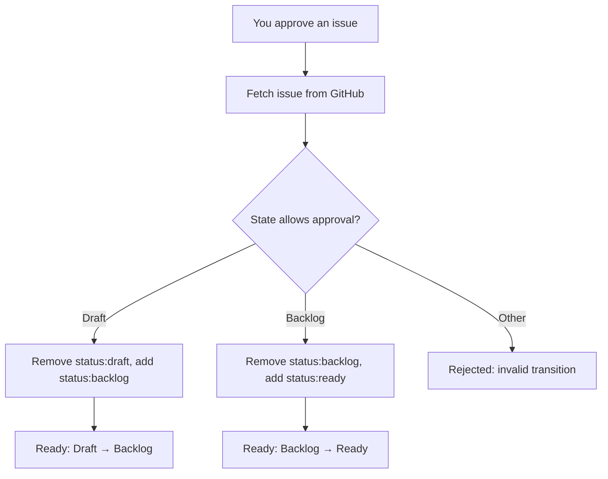
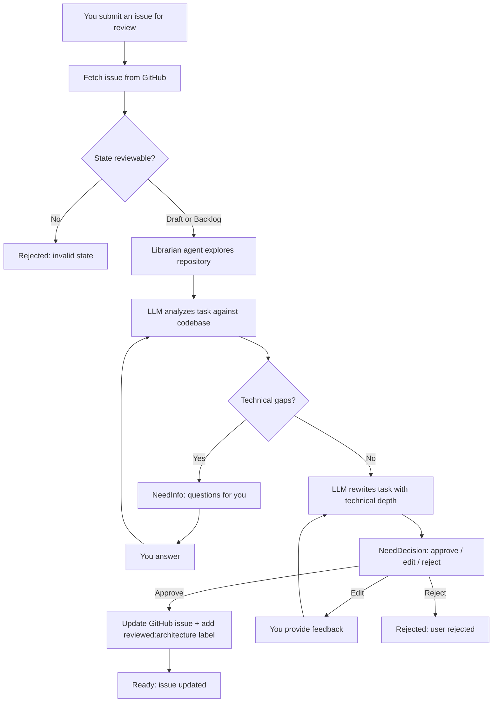
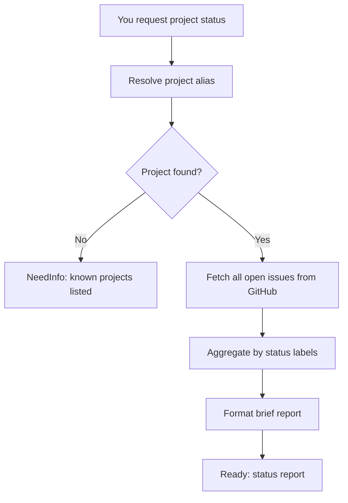

# What the Conveyor Does at Each Stage

YAAF's conveyor is composed of four workflows (pipelines). Each handles a specific phase of the task lifecycle. This document describes what each workflow does from your perspective — what you see happening, what it might ask you, and what the outcomes mean. For result type definitions, see [task-lifecycle.md](task-lifecycle.md).

## Create GitHub Issue

**What it does:** Takes your natural-language request, structures it into a well-formed task, and publishes it as a GitHub Issue.

**When it runs:** When you send a task request through the AI Factory agent (e.g., via Telegram). The agent classifies your message, identifies the project and task type, extracts a title and body, then hands off to this pipeline.

**What you see:**
- A new GitHub Issue appears in the target repository
- The issue has a `status:draft` label and a `type:bug`, `type:feature`, or `type:chore` label
- The issue body contains your structured request

**Interaction points:**
- NeedInfo if the project alias, task type, or title is missing
- NeedDecision if a duplicate title is detected among open issues
- Approval gate before publishing

**Returns:** Ready, NeedInfo, NeedDecision, or Rejected.



### Pipeline Steps in Detail

1. **Resolve** — Maps your project alias (e.g., "yaaf") to the repository (`Kuzmin-Dmitry/yaaf`). If the alias is unknown, returns NeedInfo with the list of known projects.

2. **Validate type** — Checks that the task type is one of `bug`, `feature`, or `chore` (case-insensitive). If missing or invalid, returns NeedInfo.

3. **Enrich** — Connects to GitHub to verify access and fetch recent tasks (used for dedup in the next step). This is also a health check — if GitHub is unreachable, the pipeline fails here.

4. **Review** — An LLM rewrites the task body to match the project template, ensuring it has Summary, Acceptance Criteria, and Technical Notes sections. The original meaning is preserved.

5. **Dedup** — Compares the title against all non-Done open issues (case-insensitive exact match). If a match is found and you haven't already decided, returns NeedDecision with the candidate list.

6. **Approval gate** — Previews the issue to be created and asks for your confirmation.

7. **Publish** — Creates the GitHub Issue with `status:draft` label and the type label (e.g., `type:bug`). Returns the issue number, URL, and title.

---

## Approve Task

**What it does:** Advances a task through the approval stages: Draft → Backlog (first approval) or Backlog → Ready (second approval).

**When it runs:** When you explicitly approve a task (by issue number).

**What you see:**
- The `status:draft` label is removed and `status:backlog` is added (first approval), or
- The `status:backlog` label is removed and `status:ready` is added (second approval)

**Interaction points:** None. Fully deterministic — no LLM, no clarification.

**Returns:** Ready or Rejected.



### Pipeline Steps in Detail

1. **Fetch issue** — Retrieves the issue from GitHub, reads its labels, determines the current state.

2. **Validate transition** — Checks that the current state has a valid approval path. Only Draft → Backlog and Backlog → Ready are allowed. Any other state (Ready, InProgress, InReview, Done) produces a Rejected result.

3. **Approve** — Removes the old status label and adds the new one via the GitHub API. Returns the transition details.

---

## Review Task

**What it does:** Performs an architectural review of an existing GitHub issue. Loads project code context, analyzes the task with an LLM, rewrites it with technical depth, and (after your approval) updates the issue.

**When it runs:** When you submit a Draft or Backlog task for review.

**What you see:**
- The issue body is replaced with a structured specification (Summary, Technical Context, Implementation Approach, Acceptance Criteria, Risks & Dependencies, Affected Components)
- The original description is preserved in a collapsed `<details>` block
- The `reviewed:architecture` label is added to the issue

**Interaction points:**
- NeedInfo if the analysis identifies technical gaps (up to 3 clarification rounds)
- NeedDecision after rewrite — you approve, request edits (up to 2 rounds), or reject

**Returns:** Ready, NeedInfo, NeedDecision, or Rejected.



### Pipeline Steps in Detail

1. **Fetch task** — Retrieves the issue and validates it is in a reviewable state (Draft or Backlog). Returns Rejected for any other state.

2. **Load code context** — Spawns the OpenClaw Librarian agent, which explores the repository using multi-hop navigation (read structure → follow references → verify relevance). Returns a repository tree listing and up to 15 relevant file contents (50KB total).

3. **Analyze task** — The LLM receives the issue description and the code context. It produces:
   - `affected_components` — files/modules that need changes
   - `technical_gaps` — questions requiring your input
   - `risks` — architectural risks or concerns
   - `dependencies` — internal/external dependencies
   - `suggested_approach` — high-level implementation plan
   - `completeness_score` — 1 to 5 readiness rating

   If `technical_gaps` is non-empty, the pipeline returns NeedInfo. Up to 3 clarification rounds are allowed.

4. **Rewrite task** — The LLM takes the original issue, analytical findings, and code context to produce an implementation-ready specification. If you provided edit feedback, it incorporates your notes. Up to 2 edit rounds are allowed.

5. **Submit for approval** — Presents the rewritten task as a NeedDecision result. Always returns NeedDecision with options: approve, edit, reject.

6. **Update issue** — Patches the GitHub issue body with the rewritten content and adds the `reviewed:architecture` label. Returns Ready.

---

## Project Status

**What it does:** Generates a status summary for a project — counts open issues by state, detects stale tasks, and formats a brief report.

**When it runs:** When you request a project status report (by project alias).

**What you see:**
- A summary with total open issues, broken down by status
- Stale issue count (issues not updated within the project's stale threshold — 7 days for yaaf)
- Available as plain text or Telegram-formatted HTML

**Interaction points:**
- NeedInfo if the project alias is unknown (lists available projects)

**Returns:** Ready or NeedInfo.



### Pipeline Steps in Detail

1. **Resolve** — Maps the project alias to a repository and configuration (including stale threshold). Returns NeedInfo if unknown.

2. **Fetch** — Retrieves all open issues from the repository via the GitHub API. Pull requests are filtered out. Paginates through all results (100 per page).

3. **Aggregate** — Counts issues by `status:*` label. Recognized statuses: `draft`, `backlog`, `ready`, `todo`, `in-progress`, `in-review`, `rework`, `done`. Issues with no status label or an unrecognized status label are counted as `unlabeled`. Issues not updated within the stale threshold are counted separately.

### Status Report Format

The report includes an emoji-prefixed breakdown:

```
📊 Status: yaaf — 12 open

📝 draft: 2
📋 backlog: 3
✅ ready: 1
📌 todo: 2
🔧 in-progress: 3
👀 in-review: 1

⚠️ Stale: 1
```

A Telegram-compatible version uses `<b>` tags for HTML parsing mode.
