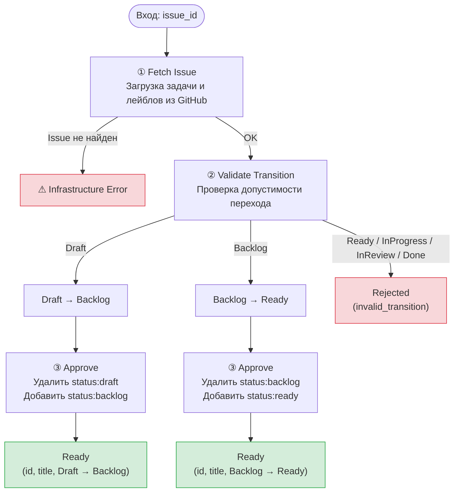
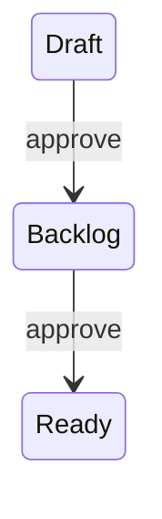

# Workflow: Approve Task

Воркфлоу `approve-task` продвигает задачу по конвейеру утверждения, переключая статусные лейблы на GitHub Issue. Пайплайн полностью детерминирован: три шага без обращения к LLM.

Утверждение — это двухступенчатый процесс. Первое утверждение переводит задачу из черновика в бэклог. Второе — из бэклога в готовность к работе. Других переходов не существует.

## Машина состояний

| Текущий статус | После утверждения | Результат |
|---|---|---|
| `Draft` | `Backlog` | Ready |
| `Backlog` | `Ready` | Ready |
| `Ready` | — | Rejected (переход невозможен) |
| `InProgress` | — | Rejected |
| `InReview` | — | Rejected |
| `Done` | — | Rejected |

## GitHub-лейблы

Состояние задачи отслеживается через лейблы на GitHub Issue:

| Лейбл | Статус |
|---|---|
| `status:draft` | Draft |
| `status:backlog` | Backlog |
| `status:ready` | Ready |
| `status:in-progress` | InProgress |
| `status:in-review` | InReview |
| `status:done` | Done |

При публикации задачи через `create-github-issue` автоматически присваивается лейбл `status:draft`. Каждое утверждение снимает старый лейбл и ставит новый.

## Шаги пайплайна

### 1. Fetch Issue — Загрузка задачи

Получает текущее состояние задачи из GitHub по номеру Issue. Считывает лейблы и определяет текущий статус по паттерну `status:*`. Если Issue не найден — ошибка инфраструктуры (исключение).

### 2. Validate Transition — Проверка перехода

Проверяет, что текущий статус задачи допускает утверждение. Допустимые переходы: Draft → Backlog, Backlog → Ready. Если задача в любом другом статусе — ранний выход с `Rejected` и описанием причины.

### 3. Approve — Выполнение перехода

Удаляет старый статусный лейбл и добавляет новый через GitHub API. Возвращает `Ready` с информацией о переходе: идентификатор, заголовок, предыдущий и новый статус.

## Вход

| Поле | Тип | Описание |
|---|---|---|
| `issue_id` | string | Номер GitHub Issue для утверждения |

## Результаты

| Результат | Когда возвращается |
|---|---|
| `Ready` | Переход выполнен успешно. Содержит: id, title, previousState, newState |
| `Rejected` | Отсутствует issue_id или статус не допускает утверждение. Содержит: reason, details |

## Инварианты

1. Допустимы только два перехода: Draft → Backlog и Backlog → Ready.
2. Ошибки инфраструктуры (API) выбрасываются как исключения, не оборачиваются в бизнес-результаты.
3. Состояние определяется по лейблам `status:*`; при их отсутствии используется статус open/closed из GitHub.
4. Старый лейбл удаляется до добавления нового — промежуточного состояния с двумя статусными лейблами быть не должно.
5. Многоходового взаимодействия нет: один вызов — один результат.

## Основные файлы

| Путь | Назначение |
|---|---|
| `lobster/workflows/approve-task.lobster` | Декларативный пайплайн (source of truth) |
| `lobster/lib/tasks/approve-task.js` | Оркестрация пайплайна |
| `lobster/lib/tasks/model.js` | Состояния, лейблы и правила переходов |
| `lobster/lib/github/tracker-adapter.js` | Операции с лейблами на GitHub |
| `test/tasks/approve-task.test.js` | Покрытие сценариев |

## Архитектурная диаграмма

