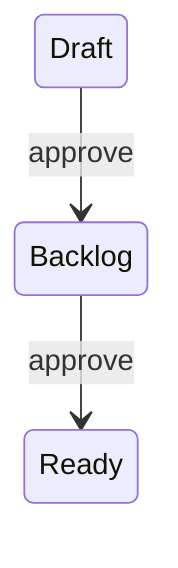
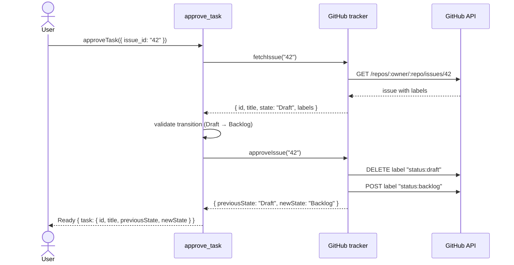

# Workflow: Approve Task

`approve_task` transitions a GitHub issue through the approval pipeline using labels to track state.

## State Transitions

| Current State | Approval Result |
|---|---|
| `Draft` | → `Backlog` |
| `Backlog` | → `Ready` |
| `Ready` | Rejected (no valid transition) |
| `InProgress` | Rejected |
| `InReview` | Rejected |
| `Done` | Rejected |

## GitHub Labels

State is tracked via GitHub issue labels. Each state maps to a label:

| Label | State |
|---|---|
| `status:draft` | Draft |
| `status:backlog` | Backlog |
| `status:ready` | Ready |
| `status:in-progress` | InProgress |
| `status:in-review` | InReview |
| `status:done` | Done |

When `create_task` publishes an issue, it attaches the `status:draft` label automatically.

When `approve_task` runs, it:
1. Reads the current state from labels
2. Validates the transition is allowed
3. Removes the old status label
4. Adds the new status label

## Happy Path

## Typed Results

| Result | Meaning |
|---|---|
| `Ready` | Transition completed successfully |
| `Rejected` | Missing issue_id or invalid transition |

## Invariants

1. Only `Draft → Backlog` and `Backlog → Ready` transitions are valid.
2. Infrastructure failures (API errors) throw — they are not wrapped as business results.
3. State is determined from `status:*` labels; falls back to GitHub open/closed state.
4. Old status label is removed before adding the new one.

## Primary Files

| Path | Why read it |
|---|---|
| `lobster/lib/tasks/approve-task.js` | Pipeline orchestration |
| `lobster/lib/tasks/model.js` | State labels and transition rules |
| `lobster/lib/github/tracker-adapter.js` | GitHub label operations |
| `test/tasks/approve-task.test.js` | Scenario coverage |
| `test/github/tracker-adapter.test.js` | Adapter-level approval tests |
