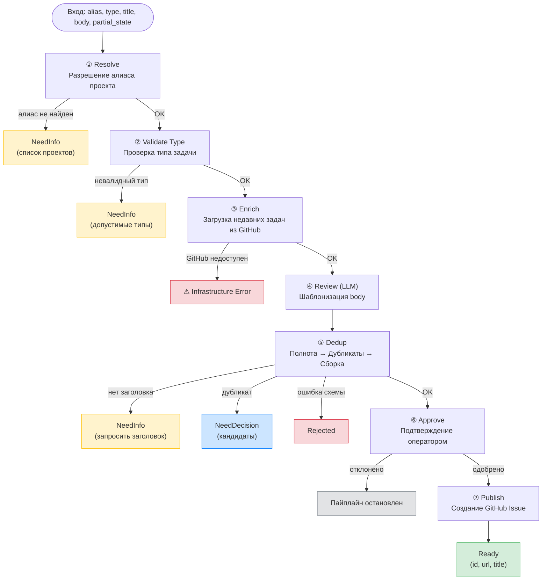

# Workflow: Create GitHub Issue

Воркфлоу `create-github-issue` — основной пользовательский сценарий создания задачи. Преобразует запрос из Telegram в валидированный GitHub Issue, проходя через цепочку детерминированных шагов с одним обращением к LLM.

Перед запуском пайплайна агент AI Factory классифицирует сообщение, определяет проект и тип задачи, извлекает заголовок и описание. Пайплайн получает уже структурированные данные.

## Участники

| Слой | Компонент | Ответственность |
|---|---|---|
| Маршрутизация | `agent.main` | Определяет намерение пользователя, передаёт PM |
| Оркестрация | `agent.pm` | Ведёт диалог уточнения, хранит `partial_state` |
| Предобработка | AI Factory agent | Классифицирует сообщение, определяет проект и тип задачи, извлекает title и body через LLM |
| Конвейер | `create-github-issue` | Валидирует, обогащает, дедуплицирует и публикует |

## Шаги пайплайна

### 1. Resolve — Разрешение проекта

Принимает алиас проекта и разрешает его в полный идентификатор репозитория через реестр алиасов. Нормализация: приведение к нижнему регистру, обрезка пробелов. Если алиас не найден — ранний выход с `NeedInfo` и списком доступных проектов.

### 2. Validate Type — Валидация типа задачи

Проверяет, что тип задачи входит в допустимый набор: `bug`, `feature`, `chore`. Если тип невалидный или не указан — ранний выход с `NeedInfo`. Если на вход уже пришёл терминальный результат от предыдущего шага, он проходит насквозь без обработки.

### 3. Enrich — Обогащение контекста

Подключается к GitHub API и загружает список недавних задач из целевого репозитория. Эти задачи используются на следующем шаге для проверки дубликатов. Шаг также служит health-check'ом: если GitHub недоступен, пайплайн останавливается с ошибкой инфраструктуры.

### 4. Review — Рецензирование и шаблонизация (LLM)

Единственный шаг, использующий LLM. Отправляет заголовок и описание задачи на проверку. LLM переписывает body в формат проектного шаблона с секциями: Summary, Acceptance Criteria, Technical Notes. Оригинальный смысл сохраняется.

### 5. Dedup — Проверка дубликатов и валидация

Объединённый шаг, выполняющий последовательно:

- **Проверка полноты**: заголовок обязателен, максимальная длина — 200 символов. При отсутствии — `NeedInfo`.
- **Поиск дубликатов**: регистронезависимое точное совпадение заголовка с открытыми задачами (кроме `Done`). Если найден дубликат — `NeedDecision` с кандидатами.
- **Сборка объекта задачи**: формирует финальный объект с title, body и state = Draft. Если валидация схемы не пройдена — `Rejected`.

Поддерживает `partial_state` для многоходового уточнения: предыдущие поля сохраняются, новые перезаписывают старые.

### 6. Approve — Подтверждение публикации

Шлюз подтверждения: оператору показывается превью задачи с запросом «Publish this GitHub issue?». Пайплайн продвигается далее только при явном одобрении.

### 7. Publish — Публикация

Создаёт GitHub Issue в целевом репозитории. Автоматически присваивает лейблы: `status:draft` и `type:{task_type}` (если тип указан). Возвращает `Ready` с идентификатором, URL и заголовком созданной задачи.

## Результаты

| Результат | Когда возвращается | Действие PM |
|---|---|---|
| `Ready` | Задача успешно создана | Сообщить об успехе, показать ссылку |
| `NeedInfo` | Не хватает данных (алиас, тип или заголовок) | Задать уточняющий вопрос, повторить с `partial_state` |
| `NeedDecision` | Найден дубликат по заголовку | Показать варианты: создать всё равно или отменить |
| `Rejected` | Данные не прошли валидацию | Объяснить причину, завершить |

## Модель уточнения

Многоходовое уточнение реализовано через `partial_state`. При повторном вызове:

- Ранее полученные поля (title, body) сохраняются.
- Новые ненулевые поля перезаписывают старые.
- PM никогда не извлекает данные самостоятельно — только передаёт ввод в пайплайн.

Каждый шаг проверяет входной JSON: если это уже терминальный результат (NeedInfo, NeedDecision, Rejected, Ready), он проходит насквозь без обработки.

## Инварианты

1. Только шаг Review обращается к LLM. Все остальные шаги детерминированы.
2. Новые задачи всегда создаются в статусе `Draft` (лейбл `status:draft`).
3. Дедупликация — регистронезависимое точное совпадение заголовка, не семантическое сходство.
4. Ошибки инфраструктуры (недоступность API) выбрасываются как исключения, не оборачиваются в бизнес-результаты.

## Основные файлы

| Путь | Назначение |
|---|---|
| `lobster/workflows/create-github-issue.lobster` | Декларативный пайплайн (source of truth) |
| `lobster/lib/tasks/cli/cgi-*.js` | Реализации отдельных CLI-шагов |
| `lobster/lib/tasks/model.js` | Типы результатов и константы валидации |
| `lobster/lib/tasks/create-task.js` | Легаси программный API (обратная совместимость) |
| `test/tasks/create-github-issue.test.js` | Основное покрытие сценариев |

## Архитектурная диаграмма

