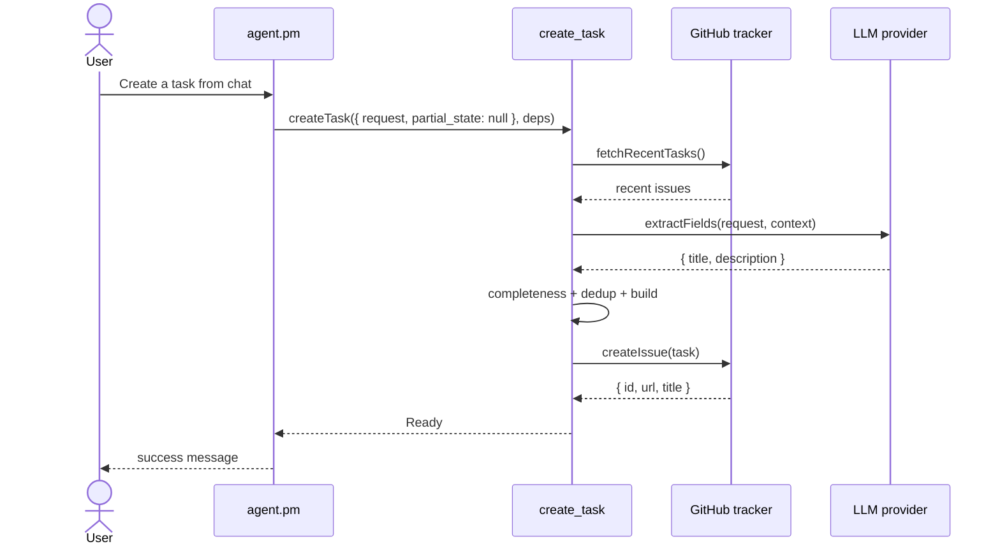

# Workflow: Create Task

`create_task` is the main user-facing workflow in the repository.

It converts a natural-language request into a validated GitHub issue while preserving a clean boundary between conversation and execution.

## Runtime Roles

| Layer | Component | Responsibility |
|---|---|---|
| Routing | `agent.main` | Detects task intent and forwards to PM |
| Orchestration | `agent.pm` | Runs clarification loop and carries `partial_state` |
| Execution | `create_task` | Parses, validates, deduplicates, and publishes |

## Happy Path



## Step Breakdown

| Step | File | What it does | Can exit early? |
|---|---|---|---|
| 1. Enrich context | `steps/enrich-context.js` | Fetches recent tasks from the tracker | No |
| 2. Parse request | `steps/parse-request.js` | Uses LLM to extract structured fields and merge with `partial_state` | No |
| 3. Check completeness | `steps/check-completeness.js` | Verifies required fields are present | Yes → `NeedInfo` |
| 4. Dedup check | `steps/dedup-check.js` | Exact-match duplicate detection against non-done tasks | Yes → `NeedDecision` |
| 5. Build task object | `steps/build-task-object.js` | Produces canonical `{ title, description, state }` | Yes → `Rejected` |
| 6. Publish | `steps/publish.js` | Calls `tracker.createIssue()` and returns `Ready` | No |

## Typed Results

| Result | Meaning | PM action |
|---|---|---|
| `Ready` | Issue created successfully | Report success |
| `NeedInfo` | Required data is missing | Ask an open question and re-invoke |
| `NeedDecision` | Ambiguity detected, usually duplicate candidate | Present bounded options and re-invoke |
| `Rejected` | Request cannot be accepted in current form | Explain reason and stop this run |

## Clarification Model

`partial_state` is the mechanism that preserves context across re-invocations.

Merge rule:

```js
merged = { ...partial_state, ...newly_parsed }
```

Operationally, that means:

- Previous non-null fields survive follow-up turns.
- New non-null fields override older values.
- PM never performs schema extraction itself.

## Invariants

1. Only step 2 uses the LLM.
2. New tasks always start in `Draft`.
3. Deduplication is case-insensitive exact-match, not semantic similarity.
4. The clarification loop is capped at 3 re-invocations.
5. Tracker failures throw instead of being wrapped as typed business results.

## Primary Files

| Path | Why read it |
|---|---|
| `lobster/lib/tasks/create-task.js` | Main pipeline orchestration |
| `lobster/lib/tasks/model.js` | Shared result types and validation constants |
| `lobster/workflows/create-task.lobster` | Declarative pipeline shape |
| `test/tasks/create-task.test.js` | Main scenario coverage |
| `test/tasks/steps.test.js` | Individual step behavior |