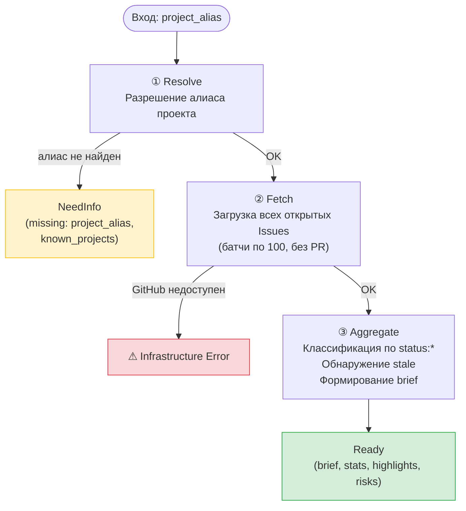
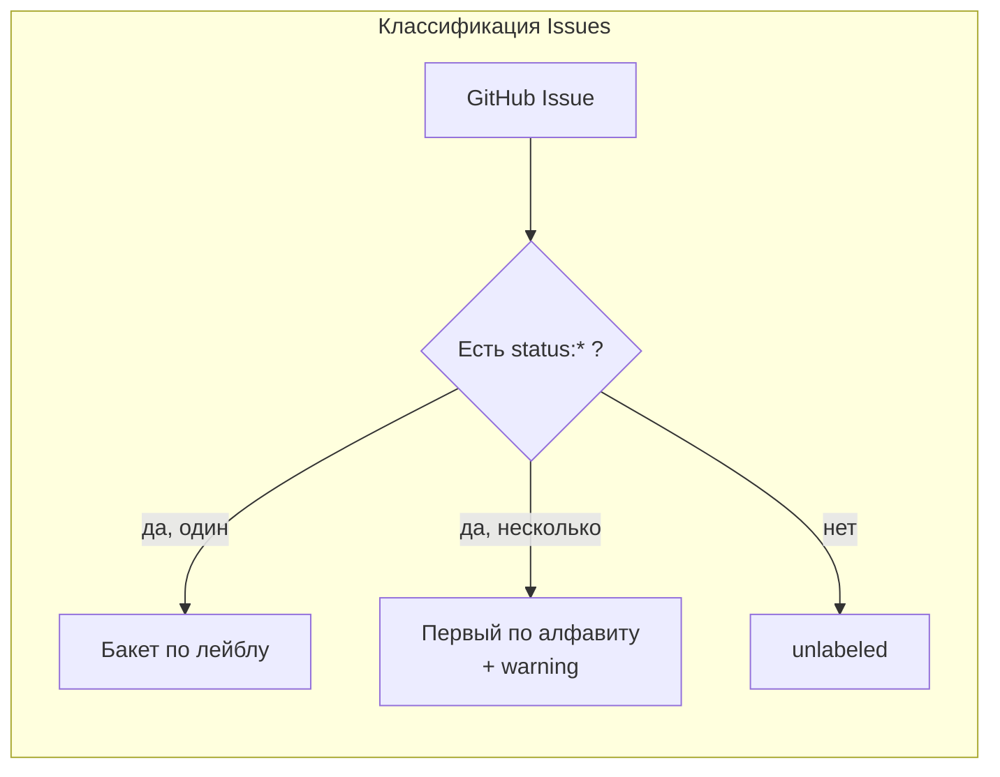

# Workflow: Project Status

Воркфлоу `project-status` — read-only пайплайн для запросов вида «дай статус по проекту yaaf». Разрешает алиас проекта, загружает все открытые Issues из GitHub, агрегирует статистику и формирует краткую сводку для PM.

Пайплайн полностью детерминирован: три шага, без обращения к LLM.

## Шаги пайплайна

### 1. Resolve — Разрешение алиаса проекта

Принимает текстовый алиас и ищет соответствие в реестре проектов. Нормализация: нижний регистр, обрезка пробелов. Сопоставление по полям `key` и `aliases`.

Если алиас не найден или не указан — ранний выход с `NeedInfo` и списком известных проектов.

Формат записи реестра:

| Поле | Описание |
|---|---|
| `key` | Каноническое имя проекта |
| `repo` | Полный идентификатор `owner/repo` |
| `aliases` | Массив допустимых алиасов |
| `stale_after_days` | Порог устаревания в днях (по умолчанию 7) |

### 2. Fetch — Загрузка открытых задач

Запрашивает все открытые Issues из целевого репозитория через GitHub REST API. Пагинация выполняется батчами по 100 записей до исчерпания. Pull Request'ы исключаются из результатов.

Для каждого Issue сохраняются: номер, заголовок, URL, лейблы, дата последнего обновления.

Если GitHub API недоступен — ошибка инфраструктуры (исключение).

### 3. Aggregate — Агрегация и формирование сводки

Классифицирует все открытые задачи по статусным бакетам и формирует PM-ready сводку.

**Классификация по статусу:**

- Если у Issue есть лейбл `status:*` — статус определяется по нему.
- Если несколько статусных лейблов — берётся первый по алфавиту, записывается предупреждение.
- Если статусного лейбла нет — задача классифицируется как `unlabeled`.

**Статусные бакеты:** `draft`, `backlog`, `ready`, `todo`, `in-progress`, `in-review`, `rework`, `done`, `unlabeled`.

**Обнаружение устаревших задач:**

- Задача считается устаревшей, если с момента последнего обновления прошло больше `stale_after_days`.
- Текущее время инжектируется через зависимость `clock` для детерминированного тестирования.

**Формат сводки:** `"Status yaaf: 12 open issues. In progress: 3, in review: 2, todo: 5, unlabeled: 2. Risks: 1 stale item."`

**Формат Telegram-сводки** (HTML parse_mode, отправляется с `parse_mode: 'HTML'`):

```
📊 <b>Status: yaaf</b> — 12 open

📝 draft: 1
📋 backlog: 2
🔧 in-progress: 3
👀 in-review: 2
📌 todo: 4

⚠️ Stale: 1
```

Каждый статус выводится на отдельной строке с эмодзи-префиксом. Нулевые статусы пропускаются.

## Вход

| Поле | Тип | Описание |
|---|---|---|
| `project_alias` | string / null | Алиас проекта из пользовательского сообщения |

## Зависимости

| Компонент | Контракт |
|---|---|
| `projects` | `resolve(alias)` — поиск проекта; `list()` — список всех проектов |
| `github` | `listOpenIssues(owner, repo)` — пагинированная загрузка Issues |
| `clock` | `now()` — текущее время (для тестов) |

## Результаты

| Результат | Когда возвращается |
|---|---|
| `Ready` | Сводка успешно сформирована. Содержит: project, brief, stats (total_open, by_status, stale_count, warnings), highlights, risks, generated_at |
| `NeedInfo` | Алиас не найден. Содержит: missing, known_projects |

## Ready payload

| Поле | Описание |
|---|---|
| `project` | Ключ и репозиторий проекта |
| `brief` | Текстовая сводка (plain text) |
| `telegram_brief` | Сводка для Telegram (HTML parse_mode) |
| `stats.total_open` | Общее число открытых Issues |
| `stats.by_status` | Распределение по статусным бакетам |
| `stats.stale_count` | Количество устаревших задач |
| `stats.warnings` | Предупреждения (например, множественные статусные лейблы) |
| `highlights` | Ключевые задачи с причиной включения |
| `risks` | Обнаруженные риски (устаревание, перегрузка) |
| `generated_at` | Метка времени генерации |

## Инварианты

1. Пайплайн полностью детерминирован, LLM не используется.
2. Статус считается из всех открытых Issues, не только из управляемых через Symphony.
3. Ошибки инфраструктуры (API) выбрасываются как исключения, не оборачиваются в бизнес-результаты.
4. Мутации данных не производятся: ни создание, ни обновление, ни удаление Issues.
5. PM обрабатывает доставку: пайплайн не отправляет сообщения в Telegram напрямую.

## Основные файлы

| Путь | Назначение |
|---|---|
| `lobster/workflows/project-status.lobster` | Декларативный пайплайн (source of truth) |
| `lobster/lib/tasks/project-status.js` | Оркестрация пайплайна |
| `lobster/lib/tasks/cli/ps-resolve.js` | Разрешение алиаса |
| `lobster/lib/tasks/cli/ps-fetch.js` | Загрузка Issues |
| `lobster/lib/tasks/cli/ps-aggregate.js` | Агрегация статистики |
| `lobster/lib/tasks/model.js` | Статусы и лейблы |
| `test/tasks/project-status.test.js` | Покрытие сценариев |

## Архитектурная диаграмма




4. Keep this behavior in a focused adapter instead of expanding the `create_task` tracker contract.

## Aggregation Rules

### Primary counts

1. `total_open`
2. `by_status.todo`
3. `by_status.in-progress`
4. `by_status.in-review`
5. `by_status.rework`
6. `by_status.unlabeled`
7. `stale_count`

### Risk heuristics for MVP

1. `rework_present`: one or more open issues in `status:rework`.
2. `stale_items`: one or more open issues not updated for more than `stale_after_days`.
3. `too_many_unlabeled`: unlabeled issues exceed a configured threshold.
4. `no_active_execution`: there are open issues, but zero `in-progress` items.

These heuristics are deterministic and explainable. They do not block `Ready`; they enrich the summary.

### Highlight selection

Select up to 3 issues using this priority order:

1. stale issues
2. `rework` issues
3. `in-review` issues
4. most recently updated remaining issues

## PM Response Format

PM receives a concise brief string. Example:

```text
Status yaaf: 12 open issues. In progress: 3, in review: 2, todo: 5, unlabeled: 2. Stale: 1.
```

## Runtime Implementation

Two source modules:

| Module | Responsibility |
|---|---|
| `lobster/lib/tasks/project-status.js` | Orchestrator: alias config, paginated fetch, pipeline |
| `lobster/lib/tasks/project-status-model.js` | Aggregation and brief formatting (pure functions) |

Changes to existing modules:

| Module | Change |
|---|---|
| `lobster/lib/github/client.js` | Added `page` parameter to `listIssues()` (backward compatible) |
| `lobster/lib/tasks/index.js` | Exports `projectStatus` |

Tests: `test/tasks/project-status.test.js` — aggregation, formatting, E2E pipeline (14 tests).

## Delivery Phases

### Phase 1 ✅

Deterministic runtime path: alias resolution, paginated GitHub fetch, aggregation, formatter, tests.

### Phase 2

Wire PM routing so requests like `дай статус по проекту yaaf` invoke `project_status`.

### Phase 3

Refine message quality, risk heuristics, and per-project tuning once real operator feedback appears.

## Acceptance Criteria

1. A PM-triggered request for a known project alias returns `Ready` with a short brief and structured stats.
2. The workflow counts all open issues in the target repository, excluding pull requests.
3. Unknown or missing project aliases return `NeedInfo`, not a thrown business error.
4. GitHub transport failures throw.
5. The design supports adding new repositories by config change, not PM code edits.
