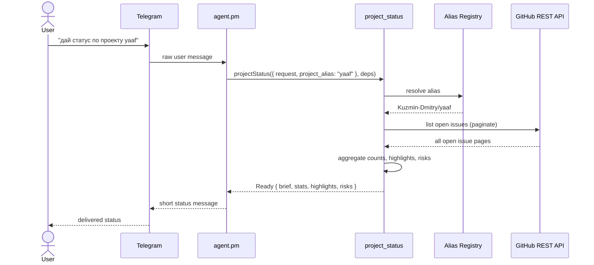
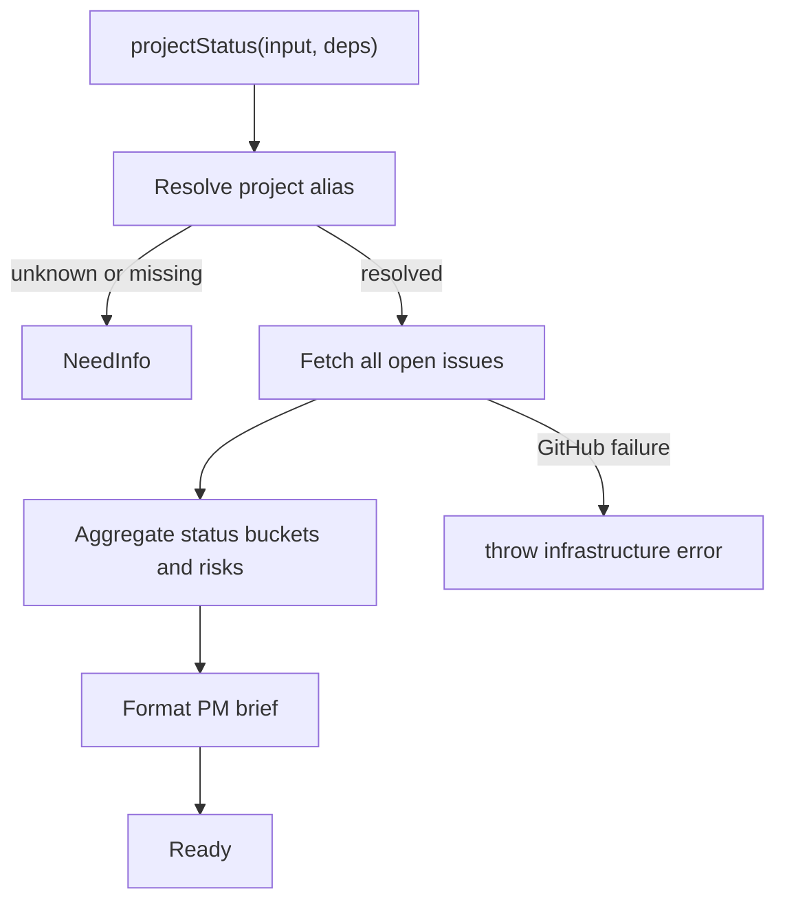

# Workflow: Project Status

`project_status` is a read-only Lobster workflow for requests such as `дай статус по проекту yaaf`.

It resolves a project alias, reads all open GitHub issues for the target repository, aggregates a concise project snapshot, and returns a PM-ready brief for delivery back to Telegram.

Status: **Phase 1 implemented and tested.** PM routing integration planned as Phase 2.

## Scope

This plan assumes the following product decisions:

1. Status is computed from all open GitHub issues, not only Symphony-managed issues.
2. The workflow must support multi-project aliases from the first version.
3. The workflow returns typed results to PM; PM or OpenClaw remains responsible for Telegram delivery.
4. The workflow is fully deterministic and does not depend on an LLM.

## User Flow



## Pipeline Shape



## Goals

1. Answer project status requests from Telegram with a short, useful summary.
2. Keep orchestration boundaries intact: PM handles the conversation, the workflow handles deterministic execution.
3. Support multiple repositories through alias resolution instead of hardcoding `yaaf`.
4. Produce a result shape that is easy to test and easy for PM to render.

## Non-Goals

1. No direct Telegram sender inside the workflow.
2. No issue creation, mutation, or synchronization.
3. No LLM summarization or semantic clustering.
4. No dependency on Symphony labels for total issue counting.

## Source of Truth

The total active workload is the set of all open GitHub issues in the resolved repository, excluding pull requests.

Status buckets are secondary classification:

1. If an issue has a recognized `status:*` label, classify by that label.
2. If an issue has multiple `status:*` labels, pick the first alphabetically and record a warning.
3. If an issue has no recognized status label, classify it as `unlabeled`.

This keeps coverage complete while still reusing the existing label model where available.

## Proposed Contract

### Input

```js
{
  request: string,
  project_alias: string | null
}
```

`project_alias` is resolved from the user message by PM routing logic when possible. If PM cannot determine it, the workflow may still receive `null` and return `NeedInfo`.

### Dependencies

```js
{
  projects: {
    resolve(alias): { key, repo, aliases, stale_after_days } | null,
    list(): Array<{ key, repo, aliases }>
  },
  github: {
    listOpenIssues(owner, repo, options?): Promise<Issue[]>
  },
  clock: {
    now(): Date
  }
}
```

`clock` keeps stale-item logic deterministic in tests.

### Results

| Result | Meaning |
|---|---|
| `Ready` | Status snapshot produced successfully |
| `NeedInfo` | Project alias is missing or unknown |
| `Rejected` | Request is structurally invalid before GitHub access |

Infrastructure failures must throw, matching current task workflow conventions.

### `Ready` payload

```js
{
  type: 'Ready',
  project: {
    key: 'yaaf',
    repo: 'Kuzmin-Dmitry/yaaf'
  },
  brief: 'Status yaaf: 12 open issues. In progress: 3, in review: 2, todo: 5, unlabeled: 2. Risks: 1 stale item.',
  stats: {
    total_open: 12,
    by_status: {
      todo: 5,
      'in-progress': 3,
      'in-review': 2,
      rework: 0,
      unlabeled: 2
    },
    stale_count: 1,
    warnings: []
  },
  highlights: [
    { number, title, url, status, updated_at, reason }
  ],
  risks: [
    { code, message, count }
  ],
  generated_at: '2026-04-02T12:00:00.000Z'
}
```

### `NeedInfo` payload

```js
{
  type: 'NeedInfo',
  missing: ['project_alias'],
  known_projects: [
    { key: 'yaaf', repo: 'Kuzmin-Dmitry/yaaf', aliases: ['yaaf'] }
  ]
}
```

## Alias Strategy

The first version should include a dedicated alias registry instead of hardcoded repo names in PM.

### Registry shape

```js
[
  {
    key: 'yaaf',
    repo: 'Kuzmin-Dmitry/yaaf',
    aliases: ['yaaf'],
    stale_after_days: 7
  }
]
```

### Resolution rules

1. Normalize alias input to lowercase and trim whitespace.
2. Match against `key` and `aliases`.
3. Return one canonical project descriptor.
4. If nothing matches, return `NeedInfo` with available project keys.
5. Do not let PM own repository mappings directly.

## Fetch Strategy

The workflow should use GitHub REST issue listing because the requirement is coverage of all open issues.

### Implementation notes

1. Paginate until exhaustion; the current low-level client only exposes a single-page `listIssues()` helper.
2. Filter out pull requests from the `/issues` response.
3. Preserve labels, assignees, `created_at`, `updated_at`, `html_url`, and issue number for downstream aggregation.
4. Keep this behavior in a focused adapter instead of expanding the `create_task` tracker contract.

## Aggregation Rules

### Primary counts

1. `total_open`
2. `by_status.todo`
3. `by_status.in-progress`
4. `by_status.in-review`
5. `by_status.rework`
6. `by_status.unlabeled`
7. `stale_count`

### Risk heuristics for MVP

1. `rework_present`: one or more open issues in `status:rework`.
2. `stale_items`: one or more open issues not updated for more than `stale_after_days`.
3. `too_many_unlabeled`: unlabeled issues exceed a configured threshold.
4. `no_active_execution`: there are open issues, but zero `in-progress` items.

These heuristics are deterministic and explainable. They do not block `Ready`; they enrich the summary.

### Highlight selection

Select up to 3 issues using this priority order:

1. stale issues
2. `rework` issues
3. `in-review` issues
4. most recently updated remaining issues

## PM Response Format

PM receives a concise brief string. Example:

```text
Status yaaf: 12 open issues. In progress: 3, in review: 2, todo: 5, unlabeled: 2. Stale: 1.
```

## Runtime Implementation

Two source modules:

| Module | Responsibility |
|---|---|
| `lobster/lib/tasks/project-status.js` | Orchestrator: alias config, paginated fetch, pipeline |
| `lobster/lib/tasks/project-status-model.js` | Aggregation and brief formatting (pure functions) |

Changes to existing modules:

| Module | Change |
|---|---|
| `lobster/lib/github/client.js` | Added `page` parameter to `listIssues()` (backward compatible) |
| `lobster/lib/tasks/index.js` | Exports `projectStatus` |
| `lobster/skills/tasks.md` | Added project status intent routing |

Tests: `test/tasks/project-status.test.js` — aggregation, formatting, E2E pipeline (14 tests).

## Delivery Phases

### Phase 1 ✅

Deterministic runtime path: alias resolution, paginated GitHub fetch, aggregation, formatter, tests.

### Phase 2

Wire PM routing so requests like `дай статус по проекту yaaf` invoke `project_status`.

### Phase 3

Refine message quality, risk heuristics, and per-project tuning once real operator feedback appears.

## Acceptance Criteria

1. A PM-triggered request for a known project alias returns `Ready` with a short brief and structured stats.
2. The workflow counts all open issues in the target repository, excluding pull requests.
3. Unknown or missing project aliases return `NeedInfo`, not a thrown business error.
4. GitHub transport failures throw.
5. The design supports adding new repositories by config change, not PM code edits.
