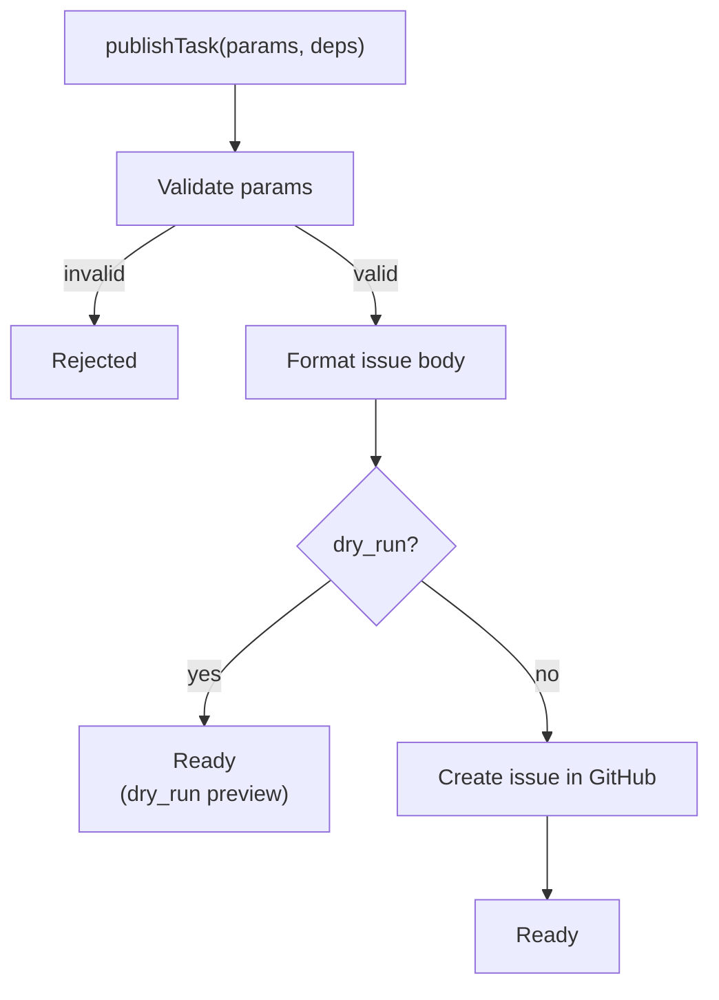

# Workflow: Publish Task

`publish_task` is the direct publishing path for already-structured input.

Use it when the system already has explicit task fields and does not need the conversational parsing loop from `create_task`.

## Execution Shape

## Primary Inputs

| Field | Meaning |
|---|---|
| `github_project` | `owner/repo` or `owner/repo/projectNumber` |
| `title` | GitHub issue title |
| `description` | Markdown body |
| `labels` | GitHub labels to set |
| `assignees` | GitHub usernames |
| `milestone` | Milestone name, resolved to number |
| `source_id` | Optional YAAF-side identifier for traceability |
| `dry_run` | Preview result without any GitHub API calls |

## Validation Rules

Current validation rules come from `publish-task-model.js`.

| Rule | Value |
|---|---|
| Title max length | 300 |
| Description max length | 65536 |
| Max labels | 50 |
| Max label length | 50 |
| Max assignees | 10 |

## Optional Project Placement

If `github_project` includes a third segment (`owner/repo/projectNumber`), the workflow will:

1. Create the issue via REST.
2. Resolve the target Project v2 via GraphQL.
3. Add the issue node ID into the project.

If the project cannot be found, the workflow throws an infrastructure-style error.

## Results

| Result | Meaning |
|---|---|
| `Ready` | Real issue created, or dry-run preview assembled |
| `Rejected` | Validation failed before any publish attempt |

## Primary Files

| Path | Why read it |
|---|---|
| `lobster/lib/tasks/publish-task.js` | Workflow orchestration |
| `lobster/lib/tasks/publish-task-model.js` | Parameter validation and `github_project` parsing |
| `lobster/lib/tasks/steps/format-issue-body.js` | Final Markdown body composition |
| `lobster/lib/tasks/steps/publish-to-github.js` | Issue creation, milestone lookup, Project v2 insertion |
| `test/tasks/publish-task.test.js` | End-to-end publish behavior |