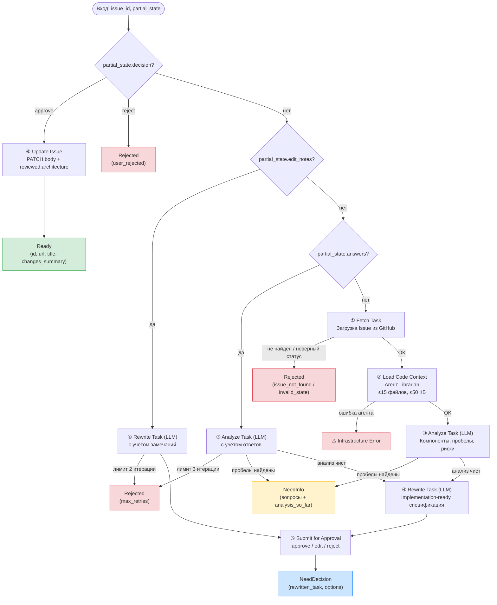

# Workflow: Review Task

Воркфлоу `review-task` проводит архитектурное ревью существующей задачи на GitHub. Загружает код проекта, анализирует через LLM, переписывает задачу с техническими деталями и обновляет Issue после одобрения пользователем.

Это самый сложный пайплайн в системе: шесть шагов, два обращения к LLM, многоходовое взаимодействие с пользователем и ограничения на количество итераций.

## Допустимые состояния

Ревью возможно только для задач в статусах `Draft` и `Backlog`. Задачи в других статусах (`InProgress`, `InReview`, `Done`) получают `Rejected(invalid_state)`.

## Шаги пайплайна

### 1. Fetch Task — Загрузка задачи

Получает Issue из GitHub по номеру. Проверяет, что задача в ревьюируемом статусе (Draft или Backlog). Если Issue не найден или статус не подходит — ранний выход с `Rejected`.

### 2. Load Code Context — Загрузка кодового контекста

Делегирует задачу агенту **Librarian** из OpenClaw. Агент исследует репозиторий методом многошагового чтения (структура → ссылки → верификация) и отбирает файлы, релевантные задаче.

Ограничения: максимум 15 файлов, суммарно до 50 КБ, большие файлы обрезаются до 200 строк. Результат — структура репозитория и содержимое отобранных файлов.

Если агент недоступен — ошибка инфраструктуры.

### 3. Analyze Task — Архитектурный анализ (LLM)

Первое обращение к LLM. На основе задачи и кодового контекста анализирует:

- Затронутые компоненты
- Технические пробелы и недостающая информация
- Риски и зависимости
- Предлагаемый подход к реализации
- Оценка полноты задачи

Если обнаружены технические пробелы — ранний выход с `NeedInfo`, содержащим список вопросов и промежуточный анализ. Пользователь может ответить на вопросы через `partial_state.answers`, после чего анализ повторяется с учётом ответов.

Лимит итераций уточнения: **3 раунда**.

### 4. Rewrite Task — Перезапись задачи (LLM)

Второе обращение к LLM. Генерирует implementation-ready спецификацию с техническими секциями:

- Технический контекст и затронутые компоненты
- Подход к реализации
- Критерии приёмки
- Риски и зависимости
- Оригинальное описание сохраняется в свёрнутой секции

Если пользователь выбрал «edit» и предоставил `partial_state.edit_notes`, перезапись выполняется повторно с учётом замечаний.

Лимит итераций редактирования: **2 раунда**.

### 5. Submit for Approval — Отправка на утверждение

Форматирует переписанную задачу как результат `NeedDecision`. Пользователю предлагаются три варианта:

- **approve** — принять и обновить Issue
- **edit** — вернуться к шагу 4 с замечаниями
- **reject** — отклонить ревью

Этот шаг всегда возвращает `NeedDecision`, останавливая пайплайн для ожидания решения.

### 6. Update Issue — Обновление задачи

Выполняется только после явного одобрения (`partial_state.decision = "approve"`). Обновляет body Issue через GitHub API и добавляет лейбл `reviewed:architecture`. Возвращает `Ready` с информацией об обновлённой задаче.

## Многоходовое взаимодействие

Пайплайн поддерживает три точки повторного входа через `partial_state`:

| Сценарий | Поле в partial_state | Шаг повторного входа | Лимит |
|---|---|---|---|
| Уточнение анализа | `answers` (ответы на вопросы) | Шаг 3: Analyze | 3 раунда |
| Редактирование результата | `edit_notes` (замечания) | Шаг 4: Rewrite | 2 раунда |
| Решение пользователя | `decision` ("approve" / "reject") | Шаг 6: Update или выход | — |

Кэшированные данные (`issue`, `code_context`, `analysis`, `rewritten`) переиспользуются при повторных вызовах, чтобы избежать дублирования запросов к GitHub и LLM.

При превышении лимита итераций пайплайн возвращает `Rejected(max_retries)`.

## Вход

| Поле | Тип | Описание |
|---|---|---|
| `issue_id` | string | Номер GitHub Issue для ревью |
| `partial_state` | object / null | null при первом вызове; накопленное состояние при повторных |

## Зависимости

| Компонент | Контракт |
|---|---|
| `tracker` | `fetchIssue(id)`, `updateIssue(id, updates)` |
| `llm` | `analyzeTask(prompt)`, `rewriteTask(prompt)` |
| `agentRunner` | `runAgentJSON(agentId, task)` — запуск агента Librarian |
| `owner`, `repo` | Координаты репозитория |

## Результаты

| Результат | Когда возвращается |
|---|---|
| `Ready` | Issue обновлён с результатами ревью. Содержит: id, url, title, changes_summary |
| `NeedInfo` | Анализ обнаружил пробелы, требуется уточнение. Содержит: questions, analysis_so_far |
| `NeedDecision` | Переписанная задача готова к утверждению. Содержит: rewritten_task, options, diff_summary |
| `Rejected` | Ревью невозможно или отклонено. Причины: issue_not_found, invalid_state, user_rejected, max_retries, missing_issue_id |

## Инварианты

1. Ревью доступно только для задач в статусах Draft и Backlog.
2. Агент Librarian использует многошаговое исследование репозитория, а не поиск по ключевым словам.
3. Автоматическое утверждение невозможно — пользователь всегда принимает решение.
4. При утверждении добавляется лейбл `reviewed:architecture`.
5. Ошибки инфраструктуры выбрасываются как исключения.
6. Лимиты итераций предотвращают бесконечные циклы уточнения.

## Основные файлы

| Путь | Назначение |
|---|---|
| `lobster/workflows/review-task.lobster` | Декларативный пайплайн (source of truth) |
| `lobster/lib/tasks/review-task.js` | Оркестрация пайплайна |
| `lobster/lib/tasks/steps/fetch-task.js` | Загрузка и валидация задачи |
| `lobster/lib/tasks/steps/load-code-context.js` | Запуск агента Librarian |
| `lobster/lib/tasks/steps/analyze-task.js` | Архитектурный анализ |
| `lobster/lib/tasks/steps/rewrite-task.js` | Перезапись задачи |
| `lobster/lib/tasks/steps/submit-for-approval.js` | Формирование NeedDecision |
| `lobster/lib/tasks/steps/update-issue.js` | Обновление Issue на GitHub |
| `lobster/lib/tasks/model.js` | Состояния, лимиты, лейбл ревью |
| `test/tasks/review-task.test.js` | Покрытие сценариев |

## Архитектурная диаграмма

